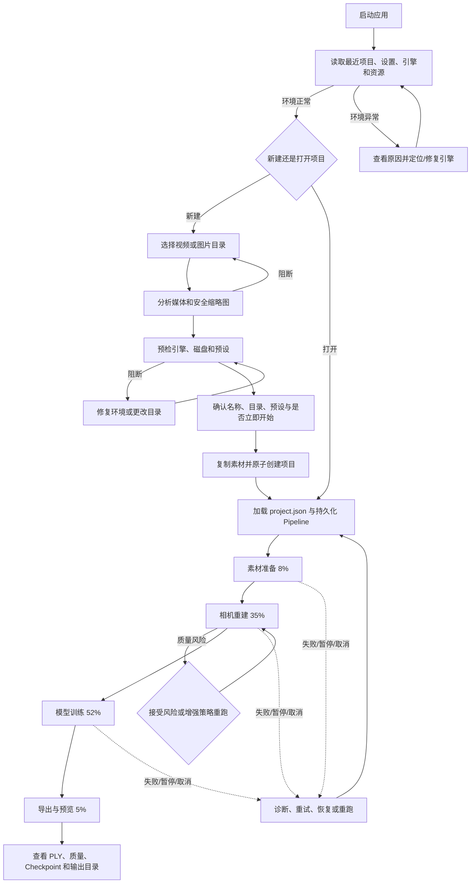
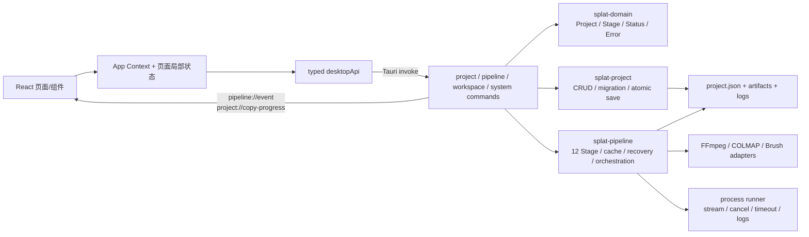
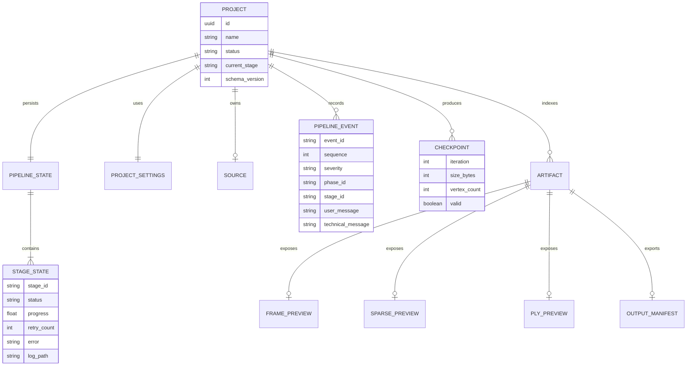

# MetOrigin Splat 当前项目 UI 分析与 Penpot 重设计准备

> 审计日期：2026-07-18
>
> 审计范围：产品、UX、UI、前端实现、Tauri/Rust 边界与 Penpot 重设计准备
>
> 本轮边界：只分析与记录证据；未修改业务代码，未安装 `emilkowalski/skills`，未连接 Penpot，未使用旧 `3dgs-engine-builder`。
>
> 公开说明：本文是审计当日的历史快照；测试数量、源码行号和界面状态以 2026-07-18 为准。文末 `.artifacts/ui-analysis/` 截图为本地审计证据，不随公开仓库发布。

## 1. Executive Summary

### 1.1 结论

MetOrigin Splat 已经不是 README 中描述的“只有首页、创建页和详情页的 MVP 壳”。当前仓库已有一条可运行的本地 3D Gaussian Splatting 闭环：视频或图片导入、媒体分析、引擎/磁盘预检、项目创建、FFmpeg/COLMAP/Brush 流水线、阶段缓存、暂停/取消/恢复、质量风险确认、真实点云/PLY 预览、Checkpoint、结构化活动记录、资源监测、诊断包和最终导出。真实技术验证曾以 1.55 GiB、4K 视频跑通 266 帧、196 张注册图像、28,365 个稀疏点、70,035 个 splat 和最终 `scene.ply`；见 `docs/plans/technical-spike.md`。

当前 UI 的主要矛盾不是“功能缺失”，而是“功能和状态没有被组织成足够可靠的专业工作台”：

1. 全局工作区壳层在首页和创建向导仍展示无上下文的进度、运行控制和状态，页面任务焦点不清。
2. 1024 px 最小宽度下项目栏被强制折叠且无法临时展开，项目查找和切换能力消失。
3. 后端已有结构化错误、恢复、风险和日志信息，前端却经常压成字符串或全局提示，无法直接回答“发生了什么、影响什么、下一步做什么”。
4. 长任务的 ETA、活动日志、产物刷新和 Checkpoint 操作仍有可信度或安全性缺口。
5. 视觉系统只有一小部分颜色/尺寸变量，单体 CSS 中大量硬编码样式、微小字号和接近的主色/危险色，不适合直接映射到 Penpot 组件库。

本审计未确认 P0。已确认 8 个 P1、9 个 P2、1 个 P3。优先应重新设计：新建项目与预检、单项目流水线工作台、失败/恢复/Checkpoint 流程。

### 1.2 推荐方向

推荐采用“项目中心 + 单项目时间线工作台”的混合结构：

- 项目中心负责首次启动、环境健康、创建/打开/查找/修复项目位置。
- 进入项目后使用时间线主导的单项目工作台；预览画布与质量检查作为同级工作区，不再由全局壳层挤压所有页面。
- 将“自动执行”与“需要用户决策”明确分层；错误卡、风险确认、恢复报告和 Checkpoint 影响范围必须成为一等交互对象。
- 保留 12 个技术 Stage，但默认用 4 个用户 Phase 表达；技术 Stage、命令、日志路径进入详情层。

### 1.3 证据等级与限制

| 等级 | 定义 | 本报告使用方式 |
| --- | --- | --- |
| A | 本轮运行截图、当前测试结果、当前运行命令 | 运行态与门禁结论 |
| B | 当前业务代码、类型、Tauri command、Rust crate | 已实现能力与状态关系 |
| C | 当前测试代码 | 可达行为、文案与 DOM 约束 |
| D | README、架构文档、计划和历史 QA | 产品意图与计划；必须与 A–C 交叉验证 |

本轮浏览器预览不具备 Tauri runtime，因此不能真实调用原生选择器、引擎、项目文件和 Pipeline。首页错误态、创建向导首步和 1024/1440 布局有 A 级截图；项目运行中、失败、完成、设置、删除、Checkpoint 等结论以 B/C 级证据为主，并明确标注为“静态推断”。没有为截图伪造业务数据。

## 2. Product Model

### 2.1 核心价值主张

MetOrigin Splat 是一个本地优先的桌面端重建工作台：让用户无需自行搭建 Python/Conda 环境，也无需把素材上传到云端，即可把视频或连续照片转换为可预览、可诊断、可恢复和可导出的 Gaussian Splatting 场景。证据包括 `README.md:3-51`、`README.zh-CN.md`、`docs/architecture.md:5-35` 和 `docs/plans/technical-spike.md`。

产品真正提供的价值不只是“一键转换”，还包括：

- 对复杂外部工具 FFmpeg、COLMAP、Brush 的版本定位、命令编排和错误隔离。
- 对分钟到小时级任务的进度、日志、取消、暂停、恢复和缓存。
- 对输入、磁盘、相机重建质量、训练产物和输出有效性的检查。
- 对项目状态和产物的持久化，使应用重启后仍可继续工作。

### 2.2 目标用户假设

| 用户 | 核心诉求 | 当前适配度 |
| --- | --- | --- |
| 3D 内容创作者、独立开发者 | 快速把实拍素材转换为 splat，用于展示、游戏或 Web | 中高；主闭环存在，但术语和恢复体验偏工程化 |
| 摄影测量/3D 扫描初学者 | 不理解 FFmpeg/COLMAP/Brush，希望获得明确指导 | 中；预检较好，失败诊断和参数解释不足 |
| 技术美术、研究者、熟练用户 | 需要指标、日志、Checkpoint、重跑和真实预览 | 中高；数据能力较强，但信息密度和联动不足 |
| 团队生产用户 | 管理大量项目、统一默认值、可追溯历史 | 低到中；当前只有最近项目列表，缺完整项目库和批量管理 |

在进入最终视觉方案前，必须确认优先服务“首次成功率”还是“专家效率”；这将影响默认信息密度、术语层级和高级参数入口。

### 2.3 使用前准备

用户至少需要：

- Windows 桌面环境；当前文档和真实技术验证均为 Windows-first。
- 视频或连续、多角度且有足够重叠的照片。
- 可写的项目目录和足够磁盘空间。
- 可用且版本匹配的 FFmpeg/FFprobe、COLMAP、Brush 引擎；当前可从应用资源、配置路径或开发环境路径定位。
- Brush/CUDA 路径下需要兼容的 NVIDIA GPU；COLMAP 和资源检查也依赖本机能力。

应用已在创建前检查媒体、引擎和磁盘，但“首次启动环境检查”没有独立的可恢复 onboarding 页面，更多通过状态栏、设置抽屉和向导预检分散表达。

### 2.4 从项目到结果的业务过程



### 2.5 自动化与用户决策

系统自动完成：媒体元数据读取、图片扫描与缩略图、预设估算、引擎和磁盘预检、素材复制、12 个 Stage 编排、缓存验证、日志与事件持久化、质量检测、产物索引、Checkpoint 扫描、崩溃后产物校验、最终导出。

用户需要决定：输入类型和路径、项目名称/目录、质量预设、是否立即启动、是否暂停/取消、是否接受低质量重建、失败后重试还是从某 Stage 重跑、使用/删除/恢复哪个 Checkpoint、何时导出或打开结果。

当前高级参数类型已存在于 `crates/splat-domain/src/project.rs:119-164`，但向导只暴露 Fast/Balanced/Quality 预设；“帧率、最大帧数、分辨率、迭代数、SH degree、Checkpoint 间隔”的细粒度配置仍是计划或模型能力，不是当前完整 UI 能力。

### 2.6 高成本和高风险阶段

| 阶段 | 风险 | 用户最关心的信息 | 当前 UI 表达 |
| --- | --- | --- | --- |
| 媒体准备 | 大文件复制、不可读素材、格式/方向问题 | 文件、尺寸、时长、帧数、估算、复制进度 | 较完整 |
| COLMAP | 映射耗时、注册率低、匹配失败 | 注册图像/率、点数、重投影误差、尝试策略、日志 | 有指标和质量风险，但错误恢复入口不集中 |
| Brush | GPU/VRAM、长时间训练、进程中断 | 当前迭代、Checkpoint、GPU、预计完成、恢复语义 | 有进度和资源指标；ETA 不可信，Checkpoint 操作缺影响确认 |
| 导出/预览 | PLY 损坏、预览性能、产物不同步 | 验证状态、splat 数、文件大小、位置 | 有真实预览与打开动作；刷新可能滞后 |

## 3. Technical Architecture

### 3.1 技术栈和运行方式

- 前端：React、TypeScript、Vite、Phosphor Icons、Three.js，见根 `package.json` 和 `apps/desktop/package.json`。
- 桌面壳：Tauri 2；默认窗口 1440×1024、最小 1024×768，见 `apps/desktop/src-tauri/tauri.conf.json`。
- 后端：Rust workspace；领域模型、项目持久化、进程执行、硬件检测、外部引擎适配和 Pipeline 编排分 crate 管理。
- 开发：根目录执行 `pnpm install` 后运行 `pnpm tauri dev`；也可运行前端 Vite，但没有 Tauri runtime 时原生命令会失败，见 `docs/development.md` 和 `apps/desktop/src/services/desktop.ts`。

本轮验证结果：

- `pnpm.cmd lint`：通过。
- `pnpm.cmd typecheck`：通过。
- `pnpm.cmd test`：6 个文件、20 项通过。
- `pnpm.cmd build`：通过；主 JS 约 864.05 kB，有 Three.js 同步打包警告。
- `cargo test --workspace --all-targets`：439 项通过，5 项真实引擎/素材测试按设计 ignored；仅有 Windows linker 信息性警告。

### 3.2 职责边界



| 层 | 职责 | 证据 |
| --- | --- | --- |
| React | 页面、工作区、交互状态、可视化、轮询、事件消费 | `apps/desktop/src/App.tsx`、`pages/`、`components/` |
| `services/desktop.ts` | 统一封装 `invoke`、原生对话框和确认 | `apps/desktop/src/services/desktop.ts:136-208` |
| Tauri commands | 对前端提供边界稳定的命令，维护活动 Pipeline/创建任务，路径授权 | `apps/desktop/src-tauri/src/commands/` |
| `splat-domain` | Project/Pipeline/Stage/Error/Hardware 等序列化领域类型 | `crates/splat-domain/src/` |
| `splat-project` | 项目目录、迁移、验证、原子保存 | `crates/splat-project/src/project_manager.rs` |
| `splat-pipeline` | Stage 注册、调度、缓存、锁、恢复、质量策略 | `crates/splat-pipeline/src/` |

### 3.3 前端如何调用后端、事件如何更新 UI

页面不直接散落调用 `invoke`，而是通过 `desktopApi` 调 `list_recent_projects`、`analyze_media`、`create_project`、`start_pipeline`、`get_pipeline_state`、`get_project_artifacts`、`get_pipeline_events` 等命令。`App.tsx:53-186` 在应用启动时并行读取版本、引擎、最近项目和设置；项目打开后监听 `pipeline://event`，收到当前项目事件即刷新快照，同时以运行中 3 秒、其他状态 10 秒轮询兜底。

资源指标由 `App.tsx:104-126` 单独采样：可见且运行中 5 秒、空闲 15 秒、窗口隐藏 30 秒。项目详情的产物与 Checkpoint 每 10 秒刷新，活动日志每 3 秒刷新。这些数据源目前不是一个统一 query/cache 层。

Reducer 会按项目 ID 缓存 PipelineSnapshot，并用 `sequence` 防止较旧的非终态快照覆盖较新的实时状态；终态的持久化快照允许以 sequence 0 收敛，见 `apps/desktop/src/context/appContextValue.ts:88-132`。

### 3.4 数据关系



`project.json` 是业务事实源，保存 Project、ProjectSettings、ProjectStatus 和 PipelineState；写入采用临时文件、flush、原子替换，见 `docs/architecture.md:74-76`、`docs/project-format.md`、`crates/splat-project/src/project_manager.rs:133-215`。产物、Checkpoint、日志和预览均由项目目录内真实文件衍生，不应由 UI 猜测。

### 3.5 12 个技术 Stage 与 4 个用户 Phase

| 用户 Phase | 技术 Stage | 权重 |
| --- | --- | ---: |
| 素材准备 | MediaValidation、FrameExtraction、ImagePreprocessing | 8% |
| 相机重建 | ColmapFeatureExtraction、ColmapMatching、ColmapMapping、ColmapValidation | 35% |
| 模型训练 | TrainingPreparation、BrushTraining、ModelValidation | 52% |
| 结果导出 | Export、PreviewGeneration | 5% |

顺序和权重由 `crates/splat-domain/src/pipeline.rs:4-273` 定义并有测试。重设计可以改变展示方式和中文名称，但不能任意改变 Stage ID、执行顺序、缓存/下游失效关系和权重来源。

### 3.6 已实现、已暴露与仅规划

| 能力 | 代码实现 | 当前 UI 暴露 | 结论 |
| --- | --- | --- | --- |
| 视频/图片导入与分析 | 是 | 是 | 可用；图片支持递归、中文路径和安全缩略图 |
| 引擎/磁盘预检 | 是 | 是 | 可用；向导阻断启动 |
| 三种预设 | 是 | 是 | 可用 |
| 自定义帧率/迭代/SH/Checkpoint 间隔 | 领域模型支持 | 否 | 尚未形成完整产品能力 |
| 创建、复制、取消复制 | 是 | 是 | 可用；有 `project://copy-progress` |
| 12 Stage、缓存和重跑 | 是 | 是 | 可用；技术 Stage 置于 Phase 详情 |
| 暂停、取消、恢复 | 是 | 是 | 可用；暂停实质为安全终止当前进程后持久化 Paused |
| 崩溃恢复 | 是 | 部分 | 后端可校验恢复；独立恢复报告/确认仍不完整 |
| 质量风险确认和增强重跑 | 是 | 是 | 可用 |
| 真实帧、稀疏点云、PLY 预览 | 是 | 是 | 可用；不是假图 |
| Checkpoint 列表/预览/恢复/删除 | 是 | 是 | 可用；恢复/删除缺影响确认 |
| 结构化事件/活动日志 | 是 | 是 | 可用；筛选、分页和 Stage 联动不完整 |
| 引擎设置、资源、诊断包 | 是 | 是 | 可用；设置加载失败和默认目录编辑不完整 |
| 项目打开、最近项目、移除、永久删除 | 是 | 是 | 可用；缺完整项目库、重命名和重定位 |
| 项目重定位 | 后端有缺失位置判断 | 否 | 规划/缺口 |
| 项目重命名 | 未形成 UI 闭环 | 否 | 规划/缺口 |
| 完整预览工具栏、截图工作流 | 部分 command/计划 | 部分 | 仍需产品化 |
| 日志分页/虚拟化 | 后端有 cursor | 否 | UI 未使用 `next_cursor` |

历史 `docs/plans/repository-audit.md` 描述的是仓库初始空状态，已明显过时，只可作为历史，不可用于判断当前实现。

## 4. Current Information Architecture

### 4.1 当前 IA 树

```text
MetOrigin Splat
├─ 全局项目栏
│  ├─ 品牌/返回首页
│  ├─ 新建项目
│  ├─ 最近项目（搜索、最多 5/20 条）
│  └─ 打开已有项目
├─ 全局顶部运行栏
│  ├─ 当前项目/“项目工作区”
│  ├─ 开始、暂停、继续、取消
│  ├─ 项目操作菜单
│  └─ 总进度、状态、预计剩余时间
├─ 主页面（Context 状态切换，无 URL 路由）
│  ├─ Home
│  ├─ New Project Wizard
│  │  ├─ 1 导入素材
│  │  ├─ 2 检查与方案
│  │  └─ 3 确认创建
│  └─ Project Detail
│     ├─ 4 Phase 时间线 / 12 Stage
│     ├─ 预览面板
│     ├─ 质量面板
│     └─ 活动工作台
├─ 全局状态栏
│  ├─ 引擎
│  ├─ GPU/VRAM/磁盘
│  └─ 版本
└─ Overlay
   ├─ 设置抽屉
   ├─ Checkpoint 抽屉
   ├─ 质量风险对话框
   ├─ 永久删除对话框
   ├─ 项目操作菜单
   └─ 全局错误提示
```

### 4.2 导航判断

页面状态只有 `home`、`new-project`、`project-detail`，见 `apps/desktop/src/context/appContextValue.ts:6-24`。这种 Context 驱动方式适合桌面单窗口，但没有历史栈、深链接或显式返回语义；关闭向导总是回首页。当前项目栏同时承担项目库、全局导航和最近历史，但 1024 宽度下核心列表完全消失。

“项目工作区”“整体进度”“状态”“预计剩余”属于项目详情上下文，却被做成所有页面共用壳层。首页和新建向导因此出现无意义的 0%、未选择项目和禁用控制。页面职责边界不清，是当前 IA 的首要问题。

## 5. User Journeys

| 旅程 | 当前入口与步骤 | 系统反馈 | 主要缺口 |
| --- | --- | --- | --- |
| 1. 首次启动与环境检查 | 启动 → 状态栏/设置/向导预检 | 并行读取引擎、设置、项目、资源 | 缺集中 onboarding；设置加载失败无专用恢复 UI |
| 2. 创建新项目 | 新建 → 三步向导 | 素材分析、预检、复制进度 | 顶部项目控制干扰；高级参数未暴露 |
| 3. 导入图片或视频 | 原生文件/目录选择 → 分析 | 视频元数据、图片数量/格式/缩略图、警告/阻断 | 首次用户缺采集质量指导和示例 |
| 4. 配置处理与训练 | 第二步选择预设 | 帧数、分辨率、迭代、磁盘估算 | 只有预设，无法理解质量/时间/显存的真实取舍 |
| 5. 启动流水线 | 创建并开始，或顶部开始 | Start command + Snapshot | 全局只允许运行一个任务，但切换项目时缺跨项目运行提示 |
| 6. 查看实时进度 | 顶栏 + Phase/Stage + 活动日志 | event + 3 秒轮询 | ETA 线性外推不可信；数据源刷新节奏不一致 |
| 7. 警告、失败和恢复 | 质量风险、阶段重试/重跑、暂停/继续 | 后端有结构化错误和恢复校验 | UI 丢失错误结构；恢复影响和日志入口不集中 |
| 8. 点云/结果预览 | 选择 Stage/产物 → Preview | 真实帧、稀疏点、相机、PLY | 窄窗进入抽屉；预览工具和状态反馈仍可强化 |
| 9. Checkpoint 与历史 | 质量区 → Checkpoint 抽屉；活动面板 | 迭代、大小、splat、有效性、事件 | 恢复/删除无确认；日志无分页和 Stage 联动 |
| 10. 导出最终结果 | 质量区 → 打开输出目录/PLY | 输出 manifest、验证、文件 reveal | “导出”更像打开产物，格式/目标/完成摘要不够清晰 |
| 11. 切换、查找、删除项目 | 左栏搜索/菜单 | 最近项目、移除、永久删除 | 最小窗口无法搜索；缺完整库、重命名、重定位 |
| 12. 修改设置 | 项目操作/状态栏 → 设置抽屉 | 引擎、默认预设、资源、诊断 | 默认项目目录类型存在但 UI 不可修改；加载失败静默 |

“暂停”必须在设计中写明：它不是冻结内存中的外部进程，而是取消当前外部进程、保存 Paused、保留有效产物/Checkpoint，继续时重新校验并执行，见 `docs/architecture.md:219-230` 和 `apps/desktop/src-tauri/src/commands/pipeline.rs:199-280`。

## 6. Screen and Component Inventory

| 对象 | 文件 | 用户目的/入口 | 主要操作与数据 | 当前状态 | 重设计建议 |
| --- | --- | --- | --- | --- | --- |
| 全局壳层 | `App.tsx`、`App.css` | 承载所有页面 | 最近项目、运行控制、状态栏、Overlay | 已实现 | 拆分项目中心壳和项目工作台壳 |
| 首页 | `pages/HomePage.tsx` | 创建或继续最近项目 | recentProjects、加载/错误、重试 | 已实现 | 升级为项目中心和首次环境健康页 |
| 新建项目向导 | `pages/NewProjectPage.tsx` | 建立可运行项目 | 媒体分析、预检、预设、目录、复制 | 已实现 | 保留三步；增强采集指导、取舍解释和错误动作 |
| 项目工作台 | `pages/ProjectDetailPage.tsx` | 运行、诊断、预览和导出 | Project、Snapshot、Artifacts、Checkpoint | 已实现 | 作为重设计核心；明确主任务区和选中对象 |
| Phase 时间线 | `ProjectDetailPage.tsx`、`pages/projectTimeline.ts` | 理解进展并选择 Stage | 4 Phase/12 Stage、状态、重试/重跑 | 已实现 | 保留信息模型，重做层级、状态和恢复动作 |
| 预览面板 | `workspace/PointCloudPreview.tsx` | 查看真实输入/稀疏点/PLY | Three.js、帧、相机、点云、键盘 | 已实现 | 保留渲染器，重做工具栏、加载/失败/性能状态 |
| 质量面板 | `ProjectDetailPage.tsx` | 判断结果可用性 | 注册率、点数、误差、Checkpoint、splat | 已实现 | 与所选 Stage/产物联动，区分阈值、未知和建议动作 |
| 活动工作台 | `workspace/ActivityWorkbench.tsx` | 追踪和诊断 | 事件、搜索、警告/错误筛选、详情 | 部分完成 | 合并重复 Tab，增加 Stage 筛选、分页、复制/打开日志 |
| 项目栏 | `shell/ProjectSidebar.tsx` | 创建、打开、搜索、切换、删除 | recentProjects、最多 5/20、菜单 | 已实现 | 宽屏持久，窄屏覆盖式抽屉；补完整项目库/重定位 |
| 顶部运行栏 | `shell/TitleRunBar.tsx` | 控制当前 Pipeline | 开始/暂停/继续/取消、总进度、ETA | 已实现 | 仅在项目上下文出现；突出当前阶段、阻断和可用动作 |
| 系统状态栏 | `shell/SystemStatusBar.tsx` | 查看环境健康 | 引擎、GPU、VRAM、磁盘、版本 | 已实现 | 作为可点击健康摘要；不要用瞬时数据制造焦虑 |
| 设置抽屉 | `settings/SettingsDrawer.tsx` | 管理引擎、默认值、资源、诊断 | settings/engines/metrics | 部分完成 | 补加载/错误/保存状态、默认目录和焦点管理 |
| Checkpoint 抽屉 | `workspace/CheckpointDrawer.tsx` | 预览、恢复、定位、删除 | CheckpointSummary | 已实现 | 恢复/删除前展示影响范围并确认 |
| 永久删除对话框 | `shell/DeleteProjectDialog.tsx` | 删除整个项目 | project ID/path 校验、忙碌态 | 已实现 | 保留；补预计删除范围/路径和输入确认策略评估 |
| 质量风险对话框 | `ProjectDetailPage.tsx` | 接受低于建议的 COLMAP 结果 | validation checks、接受风险 | 已实现 | 保留；增加替代方案对比与后续影响摘要 |
| 项目/操作菜单 | `ProjectSidebar.tsx`、`TitleRunBar.tsx` | reveal、设置、移除、删除 | 原生文件管理器、命令 | 已实现 | 统一菜单模式、键盘导航和术语 |
| 空状态 | Home、Sidebar、Activity、Checkpoint、Preview | 无项目/无数据/无日志 | loading/error/empty 文案 | 已实现但分散 | 建立统一 Empty/Loading/Error 组件和动作规范 |
| 全局错误提示 | `App.tsx` | 告知 command 失败 | reducer `error: string` | 已实现但信息损失 | 改为结构化错误中心/局部错误卡 |
| 遗留组件 | `EmptyState.tsx`、`ProjectCard.tsx`、`PipelineProgress.tsx`、`StageProgress.tsx` | 旧页面能力 | 未被当前页面引用 | 遗留 | 重设计时移除或按新组件规范重建，不直接复用视觉层 |

### 6.1 交互状态覆盖

- 加载：最近项目、引擎、媒体分析、图片预览、预检、创建复制、预览、活动日志、设置动作。
- 空状态：无项目、无匹配搜索、无日志、无 Checkpoint、无预览产物。
- 错误：最近项目加载、引擎加载、媒体/预览/预检、Pipeline、日志刷新、设置动作、全局 command。
- 禁用：无项目运行控制、控制过渡态、预检未通过、运行中移除/删除、无效产物、当前/无效 Checkpoint。
- 成功：媒体通过、预检通过、Stage 完成、质量通过、最终输出验证。
- 警告：媒体风险、资源、COLMAP 质量、活动事件。
- 破坏性：取消 Pipeline、取消素材复制、永久删除项目、Checkpoint 删除、从旧 Checkpoint 恢复、重跑 Stage 使下游失效。
- 通知：全局错误条、内联警告/阻断、对话框、状态栏；没有统一的通知中心或操作历史回执。

## 7. Runtime UI Findings

### 7.1 本轮截图

#### 1440×1024：首页的 Tauri 命令错误态


该截图证明桌面壳、首页、侧栏、顶部运行栏和底部状态栏可在 1440×1024 布局中渲染。因为 Vite 浏览器预览没有 Tauri runtime，最近项目和系统命令失败；这不是正式桌面应用的真实错误内容，但可以验证：错误发生时首页仍保留无项目的 0% 运行栏和禁用控制，页面层级被全局壳层稀释。

#### 1440×1024：新建项目第一步


三步向导、视频/图片双入口、固定底部动作区和全局壳层同时存在。主任务可发现，但顶部无项目运行信息和侧栏仍占据空间。

#### 1024×768：新建项目第一步


在 Tauri 配置的最小窗口下没有横向溢出，向导主动作仍可见；项目栏缩为 64 px。代码会因 `max-width:1120px` 强制 compact，并禁用展开按钮，见 `ProjectSidebar.tsx:70-144` 和 `App.css:1552-1597`。

#### 1024×768：首页错误态


最小尺寸下布局不溢出，但用户无法查看项目名、搜索、状态或更多项目；这不是合理的“响应式简化”，而是核心导航能力消失。

### 7.2 运行态覆盖与证据边界

| 状态 | 本轮覆盖 | 结论 |
| --- | --- | --- |
| 无项目/首页加载失败 | 真实截图 | 壳层稳定；错误和无项目运行栏层级不佳 |
| 新建项目首步 | 真实截图 | 1440/1024 无溢出，主入口清楚 |
| 有项目、详情、运行中/成功/失败 | 静态推断 + 测试 | 代码路径和测试存在；本轮无 Tauri runtime，未截图 |
| 设置、删除、质量风险、Checkpoint | 静态推断 + 测试/组件 | 组件存在；未在真实桌面进程触发 |
| 原生文件选择、打开文件夹、诊断导出 | 静态推断 + Rust 测试 | 浏览器预览不可调用 |

后续 Penpot 前仍建议用真实 Tauri 进程和一份可复制的 fixture 项目补齐运行中、失败、恢复、完成、设置和删除截图基线。

## 8. UX/UI Issues

本节按用户任务影响定级。没有把纯审美偏好列为 P0/P1。

### UX-01 — P1 — 全局运行壳层与页面上下文不匹配

- **证据**：`App.tsx:315-380` 在 Home、New Project、Project Detail 外统一渲染 `TitleRunBar`；`TitleRunBar.tsx:76-166` 在无项目时仍显示“项目工作区”、0%、未选择项目和禁用动作；四张本轮截图可见。
- **影响用户**：所有用户，尤其首次用户。
- **影响任务**：首次启动、创建项目、理解当前上下文。
- **原因**：将项目级运行控制误建模为全局应用导航。
- **建议方向**：项目中心不显示运行控制；进入项目后再显示项目标题、当前阶段、进度和控制。若后台有活动任务，用全局最小任务指示器跨页面提示。
- **验收标准**：Home/向导没有无意义的 0% 和禁用运行按钮；运行项目切换到其他页面时仍能发现其状态并返回。

### UX-02 — P1 — 最小窗口下项目查找与切换能力消失

- **证据**：`App.css:1552-1597` 隐藏 brand、sidebar content 和按钮文本；`ProjectSidebar.tsx:70-144` 在 `viewportCompact` 时禁用切换按钮。本轮 1024×768 截图验证无横向溢出但项目列表不可用。
- **影响用户**：使用最小窗口、分屏或小屏设备的多项目用户。
- **影响任务**：切换、搜索、打开、检查项目状态。
- **原因**：以强制折叠代替覆盖式导航，没有提供替代入口。
- **建议方向**：64 px rail 保留，点击项目/列表图标打开覆盖式项目抽屉；保留搜索、状态和项目菜单。
- **验收标准**：1024×768 下 1 次操作可打开完整项目列表；可搜索、切换、打开、移除和删除；关闭后焦点返回触发器。

### UX-03 — P1 — ETA 对非线性长任务制造虚假精度

- **证据**：`TitleRunBar.tsx:16-28` 用 `elapsed × remaining / progress` 线性外推；COLMAP Mapping 和 Brush 的进度、硬件和数据特征明显非线性。`docs/plans/ui-redesign-phase-2-6-execution-design.md` 原计划只在有同硬件/同预设历史时显示区间。
- **影响用户**：所有等待长任务的用户。
- **影响任务**：安排时间、判断任务是否卡住、决定暂停。
- **原因**：把加权阶段进度当作匀速时钟。
- **建议方向**：无历史时显示“正在估算”或当前 Stage 的可测单位；有历史样本后显示区间和可信度，不显示单点伪精确值。
- **验收标准**：首轮运行不输出误导性分钟数；ETA 文案注明依据；阶段切换不会出现大幅倒退或无解释跳变。

### UX-04 — P1 — 结构化错误在前端被压成字符串

- **证据**：`crates/splat-domain/src/error.rs:38-57` 已有 code、category、title、user_message、technical_message、suggestions、retryable、log_path；`App.tsx` 和多个页面大量使用 `String(error)` 写入全局错误或内联文本。
- **影响用户**：遇到引擎、媒体、资源和文件系统错误的用户。
- **影响任务**：修复环境、重试 Stage、查看日志、恢复 Pipeline。
- **原因**：服务边界未把 AppError 解析成前端类型和动作模型。
- **建议方向**：建立 ErrorNotice/ErrorDetail；默认展示用户标题、影响和建议，提供“重试、打开设置、查看日志、复制诊断信息”。技术信息折叠。
- **验收标准**：每类可恢复错误至少有一个直接动作；错误代码和日志入口可见；技术详情不会替代用户语言。

### UX-05 — P1 — 活动日志的分类、联动和历史规模不完整

- **证据**：`ActivityWorkbench.tsx:7-84` 中“活动日志”和“事件”都返回全部事件；只按 warning/error 过滤。`desktopApi.getPipelineEvents` 支持 `stageId` 和 `cursor`，后端返回 `next_cursor`，但组件未使用；选中时间线 Stage 不传给 Activity。
- **影响用户**：诊断 COLMAP/Brush、恢复失败和长时间运行的熟练用户。
- **影响任务**：定位当前阶段信息、回看早期错误、比较重试。
- **原因**：日志视图按 UI Tab 构造，而非围绕用户诊断任务构造。
- **建议方向**：合并无差异 Tab；增加 Stage/Phase、严重度、运行批次和搜索筛选；支持分页/虚拟列表、复制、打开源日志；时间线选择与日志联动。
- **验收标准**：超过 200 条事件仍可访问；选中 Stage 后默认显示相关记录；“日志”和“事件”若保留必须有可验证差异。

### UX-06 — P1 — Checkpoint 恢复和删除缺少影响确认

- **证据**：`ProjectDetailPage.tsx:600-612` 直接调用 restore/delete；`CheckpointDrawer.tsx:31-40` 无确认。恢复旧几何会影响后续训练，删除会永久失去恢复点。
- **影响用户**：训练中断、比较不同迭代或清理磁盘的用户。
- **影响任务**：恢复训练、保留历史、清理空间。
- **原因**：Checkpoint 被当作普通列表项，而不是具有下游影响的版本节点。
- **建议方向**：恢复前说明将从哪个 iteration 继续、哪些后续产物会失效、优化器状态不会恢复；删除前显示文件大小、是否唯一恢复点、不可撤销性。
- **验收标准**：恢复和删除均需明确确认；默认焦点在取消；忙碌时防重复；成功后给出持久回执和新的当前状态。

### UX-07 — P1 — 设置加载失败会静默移除设置入口能力

- **证据**：`App.tsx:75-103` 只在 settings fulfilled 时赋值，失败不记录设置错误；设置打开逻辑依赖 `settings !== null`，导致状态栏或菜单点击可能无可见结果。
- **影响用户**：引擎缺失、配置损坏或首次启动异常用户。
- **影响任务**：修复引擎、修改默认值、导出诊断。
- **原因**：设置的 loading/error/empty 被压成 nullable 对象。
- **建议方向**：显式 SettingsQuery 状态；抽屉可在失败时打开，展示原因、重试、恢复默认和诊断导出。
- **验收标准**：设置读取失败仍可打开设置面板；用户得到错误、重试和恢复动作；状态栏入口永不静默。

### UX-08 — P1 — 全局快捷键可能截获表单输入

- **证据**：`App.tsx:320-337` 对所有 Ctrl+N/Ctrl+O 生效，不排除 input/select/textarea/contenteditable 或组合输入；新建向导包含项目名输入。
- **影响用户**：键盘用户和输入项目名的用户。
- **影响任务**：新建项目、填写表单、避免丢失当前草稿。
- **原因**：应用级快捷键没有焦点上下文和未保存状态保护。
- **建议方向**：在可编辑元素中不触发全局导航；离开有草稿/复制中的向导前确认；macOS 采用 Meta 映射。
- **验收标准**：输入控件内 Ctrl/Meta 组合不误导航；离开有状态表单不会静默丢失；快捷键有菜单/Tooltip 可发现。

### UX-09 — P2 — Pipeline 与产物状态可能短时不一致

- **证据**：Pipeline 使用事件 + 3/10 秒轮询；`ProjectDetailPage.tsx:118-150` 的 artifacts/checkpoints 独立 10 秒轮询。Stage 已完成时，预览、质量和 Checkpoint 可能仍显示旧状态。
- **影响用户**：运行中查看预览或刚完成训练的用户。
- **影响任务**：判断产物是否生成、打开最终结果。
- **原因**：业务快照和产物查询没有统一失效策略。
- **建议方向**：在 Stage/Artifact 事件后按类型使查询失效；保留轮询兜底；显示“最后更新”和刷新状态。
- **验收标准**：关键 Stage 完成后 1 秒级更新相关产物；失败时保留上次数据并标注陈旧。

### UX-10 — P2 — 普通主动作与危险动作色彩过近

- **证据**：`App.css:7-24` 中主动作 `#f0445e`，危险 `#ef4e5d`，肉眼几乎同色；全局品牌标记也用主动作色。
- **影响用户**：所有用户，特别是快速扫视和色觉差异用户。
- **影响任务**：区分创建/开始与删除/取消。
- **原因**：品牌强调色和语义危险色没有独立通道。
- **建议方向**：Penpot token 中分离 `action.primary`、`status.danger`、`brand`；危险操作同时用文案、图标和确认，不只靠色。
- **验收标准**：灰阶和常见色觉模拟下仍可区分；危险按钮只用于不可逆或中断性操作。

### UX-11 — P2 — 设置文案与真实资源刷新频率不一致

- **证据**：`SettingsDrawer.tsx:60` 写“运行中每 2 秒更新”；`App.tsx:104-126` 实际为运行中 5 秒、空闲 15 秒、隐藏 30 秒。
- **影响用户**：监控 GPU/VRAM 和判断卡顿的用户。
- **影响任务**：理解指标新鲜度。
- **原因**：交互文案和实现演进未同步。
- **建议方向**：显示“约每 5 秒”或最后更新时间；窗口隐藏后标注暂停/降频。
- **验收标准**：文案与实现一致；指标显示采样时间；不可用不显示为 0。

### UX-12 — P2 — 对话框、抽屉和 Tab 的键盘模式不完整

- **证据**：Settings/Checkpoint 有 Esc 和初始焦点，但没有完整 focus trap；质量风险对话框只有初始取消焦点；`role=tablist` 没有方向键和 roving tabindex，见 `SettingsDrawer.tsx:47-63`、`ActivityWorkbench.tsx:55-84`、`CheckpointDrawer.tsx:17-40`。
- **影响用户**：键盘和辅助技术用户。
- **影响任务**：设置、Checkpoint、日志筛选、风险确认。
- **原因**：使用 ARIA role 但未实现对应完整交互模式。
- **建议方向**：组件库统一 Dialog/Drawer/Tabs；焦点困在模态层、关闭后恢复；Tabs 支持方向键/Home/End。
- **验收标准**：按 WAI-ARIA APG 键盘路径测试；无焦点泄漏；屏幕阅读器能读出标题、状态和选项。

### UX-13 — P2 — 高密度界面的可读性和操作目标偏紧

- **证据**：`App.css` 大量 9–12 px 文本和 28–32 px 图标/按钮；活动行、状态栏、Checkpoint 动作均为 11 px。按钮基类 36 px 尚可，但多个局部按钮更小。
- **影响用户**：高 DPI、长时间使用、低视力和触控板用户。
- **影响任务**：阅读日志、比较指标、点击紧邻动作。
- **原因**：用缩小字号获得专业密度，缺少密度级别和最小可读规则。
- **建议方向**：默认正文不低于 12–13 px，关键数据 13–14 px；小文本仅用于辅助元数据；动作目标至少 32×32，危险邻接增加间距。
- **验收标准**：Windows 125%/150% 缩放无裁切；关键操作和状态可在 1024×768 读取；文本对比达到 WCAG AA。

### UX-14 — P2 — 中英文混合但没有真正国际化架构

- **证据**：页面文案普遍硬编码中文；`localization.ts` 只是 Stage/Status 映射；日志中直接显示技术 ID 和 `severity.toUpperCase()`；类型和设置含英文标识。
- **影响用户**：英文用户、中文初学者、跨平台团队。
- **影响任务**：理解 Stage、错误、设置和日志。
- **原因**：领域术语本地化和应用 i18n 未分层。
- **建议方向**：建立 message key、参数化和术语表；用户层默认中文 Phase，详情显示可复制英文 Stage ID；布局为英文长文本预留 30–50%。
- **验收标准**：不改组件即可切换 zh-CN/en；无拼接语序错误；日期、数字、单位按 locale 格式化。

### UX-15 — P2 — 最近项目列表不能承担长期项目管理

- **证据**：`ProjectSidebar.tsx:101-114` 最多显示 20 项，默认 5 项；搜索仅项目名、status 和 stage_label；丢失路径只能移除最近记录，没有重定位。`workspace` command 已能返回缺失位置诊断。
- **影响用户**：长期、多项目和移动项目目录的用户。
- **影响任务**：查找、恢复位置、归档、删除。
- **原因**：把 recent list 当成 project library。
- **建议方向**：首页项目中心提供完整项目库、路径、更新时间、状态、源类型、排序/筛选和重定位；侧栏只保留最近/固定项目。
- **验收标准**：20+ 项目仍可查找；路径丢失可重定位或移除；搜索覆盖名称、源文件名和路径。

### UX-16 — P2 — 默认目录与高级参数存在于数据模型但缺产品入口

- **证据**：`AppSettings.default_project_root` 存在于 `types/system.ts` 和 Tauri settings；向导读取它，设置抽屉不能修改。`ProjectSettings` 支持多项自定义参数，向导只选择预设。
- **影响用户**：重复创建项目和专家用户。
- **影响任务**：减少重复设置、控制性能/质量。
- **原因**：设置与向导没有完整映射业务配置模型。
- **建议方向**：设置中支持默认项目根；向导以“高级设置”渐进披露，展示范围、默认值、影响和恢复预设。
- **验收标准**：修改默认目录影响后续新项目而不改已有项目；高级参数通过前后端校验并在确认页摘要。

### UX-17 — P2 — 设计系统不足以支撑 Penpot 与代码长期同步

- **证据**：`App.css:1-24` 只有颜色和两项布局尺寸 token；约 1853 行单体 CSS 中间距、字号、圆角、边框、背景和阴影大量硬编码；不同局部按钮重复定义。
- **影响用户**：间接影响一致性；直接影响设计和前端团队效率。
- **影响任务**：所有页面的持续迭代和跨平台适配。
- **原因**：功能按阶段增量叠加，尚未形成 foundation/component token 与可复用 primitives。
- **建议方向**：先定义语义 token 和组件状态，再在 Penpot 创建组件库；代码组件按同一命名映射。
- **验收标准**：同一语义的颜色/间距/圆角不再散落；Penpot variant 与代码 props/state 有一一映射表。

### UX-18 — P3 — Three.js 同步进入主包

- **证据**：本轮 `pnpm.cmd build` 主 JS 约 864.05 kB；`design-qa.md:59` 也记录 Three.js 懒加载后续项。
- **影响用户**：冷启动和低性能设备用户。
- **影响任务**：首次打开应用和非预览页面。
- **原因**：点云预览模块同步打包。
- **建议方向**：项目工作台预览按需加载，提供稳定 skeleton；本轮不改实现。
- **验收标准**：Home/向导不下载或初始化 Three.js；预览首次打开有明确加载反馈，主 chunk 显著下降。

## 9. Existing Design System

### 9.1 当前基础值

| 类别 | 当前实现 | 审计判断 |
| --- | --- | --- |
| 色彩 | 深色 canvas/sidebar/panel/elevated/input；主色、active、success、warning、danger | 有初步语义，但主色与危险色冲突；大量局部硬编码 |
| 字体 | Segoe UI Variable、Segoe UI、Microsoft YaHei UI | 适合 Windows-first；需验证 macOS/Linux fallback |
| 字号 | 约 9–24 px，常用 11–13 px | 专业密度高，但关键区域偏小 |
| 行高 | 多为默认或局部设置 | 缺统一 type scale/line-height token |
| 间距 | 3、4、5、7、8、9、10、12、14、16、18 等 | 无 spacing scale，难以一致 |
| 圆角 | 4、5、8 px 等 | 控件和容器规则不明确 |
| 阴影 | 抽屉/弹出层局部硬编码 | 缺 elevation 层级 |
| 边框 | subtle/strong 两个 token + 多个硬编码 | 基础可保留，需增加 focus/selected/danger 语义 |
| 图标 | Phosphor Icons | 一致性较好，应保留；需统一 size/weight 规则 |
| 按钮 | primary、secondary、danger、warning、icon；局部另有按钮样式 | 类型齐全但实现分散、危险色冲突 |
| 表单 | input、路径选择、preset rows、搜索 | 缺统一 label/help/error/success/disabled 结构 |
| 状态 | 文本 + 图标 + 颜色 | 优点；需要统一 status badge 和 event severity |
| 卡片/面板 | panel、metric、engine、checkpoint、analysis 等 | 语义多但视觉规则重复 |
| 布局 | 232 px sidebar、40 px status、主工作区 2 栏+活动行 | 适合宽屏；最小宽度策略需重做 |
| 断点 | 1120、1100 px | 有桌面降级，不是移动响应式 |
| 动画 | 120 ms 过渡、spinner；reduced-motion | 基础良好；缺 motion token/状态转场原则 |

### 9.2 当前 CSS token

`App.css:1-24` 已定义：`bg.canvas/sidebar/panel/elevated/input`、`border.subtle/strong`、`text.primary/secondary/muted`、`accent.primary/hover/active`、`state.success/warning/danger`、`sidebar-width`、`status-height`。这些可作为迁移输入，但不能直接当最终品牌系统。

### 9.3 可保留、重定义与进入未来组件库

可保留的不是现有视觉像素，而是行为和信息模型：

- Phase/Stage 映射、状态机、进度数据、未知值“尚未测量”。
- Phosphor 图标体系。
- PointCloudPreview 的真实数据解析和键盘交互能力。
- 对话框默认取消焦点、reduced-motion、状态不只依赖颜色等已有良好实践。
- `desktopApi`、原生选择器、路径授权和后端 DTO。

需要重定义：App Shell、项目导航、运行栏、ErrorNotice、Button 语义、Dialog/Drawer/Tabs、日志表、进度/ETA、表单字段、状态栏、空/加载/失败状态。

未来 Penpot 组件库至少应包含：

- App shell、project rail/drawer、workspace header、status bar。
- Button、IconButton、MenuItem、ToolbarButton。
- Input、Search、Select、NumberField、PathPicker、FormField、HelpText。
- StatusBadge、SeverityBadge、ProgressBar、IndeterminateProgress、PhaseNode、StageRow。
- Alert/ErrorNotice/RecoveryCard、Toast、InlineMessage、EmptyState、Skeleton。
- Panel、MetricCard、ProjectRow/Card、EngineCard、CheckpointItem、ArtifactItem。
- Dialog、Drawer、Popover/Menu、Tabs、DataTable、LogRow/EventDetail。
- PreviewCanvas、PreviewToolbar、QualitySummary、ResourceMeter。

### 9.4 建议的 token 分类（本轮不决定最终品牌值）

```text
color.primitive.*
color.surface.{canvas,sidebar,panel,elevated,overlay,input}
color.text.{primary,secondary,muted,inverse,link}
color.action.{primary,primaryHover,secondary,selected,focus}
color.status.{info,success,warning,danger,paused,running}
color.data.{phaseMedia,phaseColmap,phaseTrain,phaseExport}

font.family.{ui,mono}
font.size.{caption,bodySm,body,bodyLg,titleSm,title,titleLg}
font.weight.{regular,medium,semibold,bold}
font.lineHeight.*

space.{0,1,2,3,4,5,6,8,10,12}
radius.{control,panel,overlay,pill}
border.width.* / border.color.*
shadow.{popover,drawer,dialog,focus}
motion.duration.{fast,normal,slow}
motion.easing.*
layout.{sidebarExpanded,sidebarRail,statusHeight,contentMax}
zIndex.{base,sticky,popover,drawer,dialog,toast}
density.{comfortable,compact}
```

## 10. Technical Constraints

### 10.1 必须保留

- 本地优先、素材不上传；预览只访问当前项目根内由后端授权的文件。
- `project.json` 作为持久化事实源，schema version、原子保存和迁移语义。
- ProjectStatus、StageStatus 和 12 个 Stage ID/顺序；4 Phase 可作为用户层映射。
- 总进度来自 8%/35%/52%/5% 的产品权重，不可在前端随意重算。
- 全应用同一时刻只有一个活动 Pipeline；允许浏览其他项目。
- 暂停、取消、恢复、缓存、重试、从 Stage 重跑及下游失效的真实语义。
- 事件的 project_id、sequence、timestamp；高频进度不应全部进入 `aria-live`。
- 真实未知值显示“尚未测量”，不得伪造 loss、ETA、质量或预览。
- Tauri 原生文件/目录选择、打开文件管理器、诊断导出和路径安全校验。
- 默认 1440×1024、最小 1024×768 的桌面窗口目标。
- 项目删除和路径命令的 ID/path 双重校验、根目录保护和符号链接逃逸保护。
- 诊断包路径脱敏，不包含视频、图片或 PLY 本体。

### 10.2 可以调整

- Home/Workspace 的壳层和导航层级；可以引入项目中心和覆盖式抽屉。
- Phase 中文名称、信息层级、面板布局和默认选中规则。
- Context 状态的组件拆分和 query/cache 策略，只要 command DTO 保持兼容。
- 视觉风格、主题、密度、组件外观、微交互和动效。
- 轮询间隔与事件触发的查询失效策略。
- 日志、质量、Checkpoint 和预览的组合方式。

### 10.3 需要产品决策

- 首要用户是初学者还是熟练技术用户；是否提供“简洁/专业”密度或模式。
- 创建后默认“仅创建”还是“创建并开始”；是否允许全局设置。
- 高级参数开放范围，以及专家设置的责任提示。
- 低质量 COLMAP 的接受政策；是否允许带风险继续、是否记录到最终 manifest。
- Checkpoint 恢复到底意味着“预览版本”“训练起点”还是“回滚项目状态”。
- 项目库规模、固定/归档/标签、重命名和重定位是否进入 v1。
- v1 是否 Windows-only；macOS/Linux 是否为设计验收目标。
- 最终品牌方向、是否只做深色主题、是否需要 light/high-contrast。

### 10.4 需要技术验证

- 真实 Tauri 进程下所有页面和过渡状态截图，尤其失败、恢复和完成。
- 事件高频更新与日志 1,000/10,000 条时的性能、分页和虚拟化。
- Three.js 在 1024×768、集成显卡、高 DPI 和切换 20 次模型时的内存/显存表现。
- macOS/Linux 原生标题栏、菜单、快捷键、路径、文件 reveal 和引擎分发差异。
- 完整 focus trap、屏幕阅读器和 Windows 125%/150% 缩放。
- 中英文资源化后对现有测试选择器的影响。

### 10.5 自动化测试约束

`NewProjectPage.test.tsx`、`ProjectSidebar.test.tsx`、`TitleRunBar.test.tsx`、`DeleteProjectDialog.test.tsx` 等测试依赖可访问名称、按钮文案、role 和部分 DOM 状态。重设计可以改 DOM，但应先把测试从脆弱文案断言迁移到稳定的可访问角色/业务状态；不应为了保留旧 DOM 而牺牲设计，也不能无计划删除现有可访问名称。

## 11. Redesign Opportunities

### 方向 A：项目中心式

- **理念**：先管理输入、环境和项目，再进入工作台。
- **适合用户**：初学者、长期多项目用户。
- **IA**：Home 升级为项目库；环境健康、最近/全部项目、新建/打开集中。
- **工作区**：项目详情独立壳层，返回项目中心。
- **Pipeline**：项目卡只显示摘要；详情中显示时间线。
- **长任务/异常**：项目中心显示后台活动和失败项目，进入项目处理。
- **优点**：首次启动和多项目管理清楚；修复 1024 导航问题。
- **风险**：单项目重度用户多一次导航；项目中心可能过重。
- **复杂度**：中。

### 方向 B：单项目三栏专业工具式

- **理念**：左侧 Pipeline/对象，中间预览，右侧质量/属性，底部活动。
- **适合用户**：技术美术、研究者、熟练用户。
- **IA**：进入项目后所有功能围绕选中 Phase/Stage/Artifact。
- **工作区**：三栏 + 可折叠底部活动；1024 时侧栏/检查器转抽屉。
- **Pipeline**：左侧垂直 Phase/Stage，当前状态和恢复动作就地显示。
- **长任务/异常**：右侧错误/质量卡，底部日志自动联动。
- **优点**：高效、上下文明确、真实预览价值高。
- **风险**：首次用户认知负担高；窄窗设计复杂。
- **复杂度**：中高。

### 方向 C：预览画布主导式

- **理念**：把 3D 结果和采集质量作为核心，Pipeline 变成画布旁的任务轨道。
- **适合用户**：以视觉结果判断为主的创作者。
- **IA**：大画布、浮动/侧边时间线、质量 HUD、底部日志抽屉。
- **工作区**：预览占最大面积；未有产物时用真实输入/采集指导填充。
- **Pipeline**：阶段以紧凑轨道表达。
- **长任务/异常**：画布上显示非阻塞进度，问题进入任务中心。
- **优点**：产品差异化强，结果导向明显。
- **风险**：早期阶段无 3D 产物时画布价值低；日志和参数容易被隐藏。
- **复杂度**：高。

## 12. Recommended Design Direction

推荐“A + B 的混合”：项目中心负责跨项目和首次环境，单项目内采用时间线主导的三栏专业工作台；不推荐把画布设为全流程唯一主导。

依据：

1. 产品既有多项目管理需求，又有单项目分钟/小时级深度任务，单一布局无法同时优化。
2. 真实价值集中在 Pipeline 可控性、恢复、质量和预览，而不是纯项目列表或纯 3D 观看。
3. 4 Phase/12 Stage 已是稳定业务模型，时间线适合表达依赖、当前状态和下游失效。
4. 预览在前半段可能只有素材/稀疏点，在后半段才成为主角，因此应随 Stage 切换内容和面积，而不是永久占据最大空间。
5. 1024×768 需要 rail + 覆盖抽屉的降级；1440×1024 可提供完整三栏和底部活动。

建议宽屏结构：左侧项目 rail/Phase 时间线（240–280 px），中间动态工作区/预览（自适应），右侧所选对象的质量/动作（320–380 px），底部活动面板可调整高度。项目中心和创建向导使用专属内容壳，不出现项目运行栏。

## 13. Penpot-ready Design Brief

以下内容可直接作为下一阶段 Penpot MCP 的基础输入；在实际调用时附上本报告和关键截图。

### 13.1 产品定义

- **产品名称**：MetOrigin Splat。
- **一句话定位**：本地优先、可恢复、可诊断的桌面 3D Gaussian Splatting 重建工作台。
- **目标用户**：3D 内容创作者、技术美术、摄影测量初学者和需要本地可控流程的研究/开发用户。
- **核心任务**：把视频或连续照片可靠地转换为经验证、可预览、可继续训练和可导出的 Gaussian Splatting PLY。

### 13.2 设计目标

1. 首次用户能理解准备条件并成功创建第一个项目。
2. 长任务中随时知道“当前在做什么、是否正常、还需要用户做什么”。
3. 失败、警告、暂停、恢复、重跑和 Checkpoint 的影响可预测、可逆处尽量可逆。
4. 专业用户可以查看真实指标、Stage、日志、产物和资源，而不淹没初学者。
5. 1440×1024 高效，1024×768 不丢核心能力。
6. Penpot 组件、token 与 React 组件状态可以建立一一映射。

### 13.3 非目标

- 不重设计 3D 算法、Stage 顺序、command DTO 或项目文件格式。
- 不制作移动端 UI。
- 不把云上传、协作、队列并行训练加入本轮。
- 不伪造 loss、ETA、质量或预览数据。
- 不在视觉设计阶段改变暂停/恢复和下游失效的业务语义。

### 13.4 页面清单、导航和优先级

| 优先级 | 页面/状态 | 目标 |
| --- | --- | --- |
| P0 | 项目中心 / 首次启动 | 环境健康、新建、打开、搜索、修复丢失项目 |
| P0 | 三步新建项目向导 | 导入、分析、预检、方案、确认、复制 |
| P0 | 单项目工作台—Ready/Running | 时间线、预览、质量、日志、运行控制 |
| P0 | 单项目工作台—Failed/Paused/Recovering | 诊断、影响说明、重试/重跑/继续 |
| P0 | 完成与导出 | 结果摘要、PLY/目录、质量和再次运行 |
| P1 | Checkpoint 管理 | 预览、恢复、删除、影响确认 |
| P1 | 设置与环境 | 引擎、默认值、资源、诊断 |
| P1 | 项目删除/移除/重定位 | 安全管理项目 |
| P2 | 项目库高级筛选和批量能力 | 面向长期用户扩展 |

主导航：项目中心 → 项目工作台。工作台内部主导航不是多个独立页面，而是 Phase/Stage/Artifact 选择；设置使用全局抽屉；活动可作为底部可调整面板；窄窗项目和检查器使用覆盖抽屉。

### 13.5 关键页面内容层级

**项目中心**

1. 应用与引擎健康摘要；阻断项带修复动作。
2. 新建项目、打开已有项目。
3. 活动项目/失败项目提醒。
4. 最近/全部项目：名称、状态、当前 Phase、更新时间、源类型、路径健康。
5. 搜索、排序、筛选、重定位、移除、永久删除。

**新建项目向导**

1. Step、标题、当前目标和退出。
2. 视频/图片入口及采集建议。
3. 真实分析结果、缩略图、警告/阻断。
4. 引擎/磁盘健康和 Fast/Balanced/Quality 对比。
5. 渐进披露的高级参数。
6. 名称、目录、复制大小、预计帧数/迭代的最终摘要。
7. 仅创建 / 创建并开始；复制进度和安全取消。

**单项目工作台**

1. 项目名称、状态、当前 Phase/Stage、主要运行控制。
2. 4 Phase 时间线；展开后显示 12 Stage、进度、耗时、缓存、重试和错误。
3. 主工作区随选中对象展示输入、稀疏重建、Checkpoint 或最终 PLY。
4. 右侧检查器展示质量、产物、资源、风险和上下文动作。
5. 底部活动展示筛选、日志、错误、技术详情和源日志入口。
6. 后台活动项目在离开项目时仍有全局最小指示。

**失败/恢复**

1. 用户可理解的错误标题和影响。
2. 错误代码、类别、发生 Stage、时间和日志。
3. 按优先级排列的修复建议。
4. 重试当前 Stage、从 Stage 重跑、打开设置、查看日志、导出诊断。
5. 将失效的下游 Stage/产物预览。
6. 恢复报告：已验证、将跳过、将重跑、采用的 Checkpoint。

**完成与导出**

1. 最终成功摘要和质量状态。
2. 最终 PLY 预览、splat 数、大小、更新时间、验证状态。
3. 打开 PLY、打开输出目录、复制路径。
4. COLMAP/训练关键指标和风险记录。
5. Checkpoint 与再次运行/更高质量预设入口。

### 13.6 关键组件状态与变体

- ProjectRow：ready/running/paused/recovering/failed/completed/missing；selected/hover/focus。
- PhaseNode/StageRow：pending/preparing/running/pausing/paused/cancelling/cancelled/completed/failed/skipped/cached；expanded/selected/retryable。
- Progress：determinate/indeterminate/stalled/unknown/completed；带单位或不带 ETA。
- ErrorNotice：info/warning/error/blocking；retryable、settings action、log action、diagnostics action。
- ArtifactItem：missing/generating/available/validated/invalid/stale。
- CheckpointItem：valid/invalid/current/selected；restore/delete busy。
- Dialog/Drawer：default/busy/error；键盘 focus trap 和关闭后恢复。
- PreviewCanvas：empty/loading/ready/warning/error/unsupported/performance degraded。
- ResourceMeter：available/warning/critical/unavailable/stale。
- Button：primary/secondary/quiet/warning/danger；default/hover/pressed/focus/disabled/loading。

### 13.7 Token 与可访问性要求

- 使用第 9.4 节 token 分类；品牌色、主动作色和危险色必须分离。
- 正文和关键数据达到 WCAG AA；状态不能只靠颜色。
- 默认正文建议不低于 12–13 px；动作目标至少 32×32；焦点环清晰。
- Dialog/Drawer focus trap，关闭后恢复触发器；Tabs、Menu、Timeline 完整键盘模式。
- 高频百分比不持续轰炸 `aria-live`；Stage 变化、阻断和错误进入 polite/assertive 区域。
- 支持 `prefers-reduced-motion`、Windows 125%/150% 缩放和高对比验证。

### 13.8 国际化要求

- 首轮至少设计 zh-CN 和 en 两套文案长度。
- 用户层用本地化 Phase；技术详情保留可复制 Stage ID、引擎名和错误码。
- 不用字符串拼接构建句子；日期、时间、数字、百分比和单位 locale 化。
- 英文按钮和错误文本按中文的 1.3–1.5 倍空间预留。

### 13.9 桌面尺寸建议

- 主要设计基准：1440×1024。
- 次要验证：1280×800。
- 最小可用：1024×768，必须保留项目、运行控制、预览/质量入口和错误恢复动作。
- 不设计手机断点；窄桌面使用 rail、覆盖抽屉、可折叠活动区。
- 需要标明系统标题栏/窗口控制区，后续验证 Windows、macOS、Linux 差异。

### 13.10 必须设计的异常与边界状态

- 首次启动：设置损坏、引擎缺失/版本不匹配、GPU 不可用、磁盘不可读。
- 导入：取消选择、损坏视频、无视频流、空图片目录、混合格式、中文/超长路径。
- 创建：项目重名、无写权限、磁盘不足、复制取消/失败、目标目录切换后重新预检。
- Pipeline：其他项目正在运行、启动失败、进度未知、长时间无更新、暂停中、取消中。
- COLMAP：注册率警告/失败、多次自动尝试、接受风险、增强策略重跑。
- Brush：VRAM 高、Checkpoint 可用、进程崩溃、几何恢复但优化器未恢复。
- 预览：文件尚未生成、无效 PLY、解析慢、GPU/内存不足、数据陈旧。
- 项目：路径丢失、project.json 损坏/迁移、移除最近记录、永久删除失败。
- 日志：0、200、1,000+ 条；刷新失败但保留旧数据。

### 13.11 原型必须覆盖的交互

1. 首次启动缺引擎 → 打开设置 → 定位/重新检查 → 恢复可创建状态。
2. 选择视频/图片 → 分析 → 预检警告/阻断 → 更改目录/预设 → 创建并开始。
3. Ready → Running → Phase/Stage 更新 → 查看日志和预览。
4. 质量风险 → 比较接受风险和增强重跑。
5. Failed → 查看结构化错误/日志 → 重试当前 Stage 或从 Stage 重跑。
6. Running → 暂停 → 恢复报告 → 从有效产物/Checkpoint 继续。
7. Checkpoint 预览 → 恢复影响确认；删除影响确认。
8. Completed → 预览最终 PLY → 打开输出目录/PLY。
9. 项目搜索、路径丢失重定位、移除和永久删除。
10. 1440 与 1024 两种窗口下打开项目抽屉、检查器和活动区。

### 13.12 设计交付验收标准

- 所有 P0 页面和异常状态有 1440×1024 设计；核心路径有 1024×768 变体。
- 每个主动作都有 loading、disabled、success、error 和重复提交策略。
- 12 Stage、4 Phase、11 ProjectStatus、10 StageStatus 均有明确表现。
- 错误、风险、恢复和破坏性操作展示影响范围与下一步。
- Penpot 组件使用 variant/property 表达状态，不为每个页面复制组件。
- token、组件、页面和 React 实现建立映射表。
- 原型能完整走通创建、运行、失败恢复、Checkpoint 和导出。
- 不出现伪造指标、不可达按钮、无解释的禁用或窄窗丢失核心能力。

## 14. Open Questions

进入 Penpot 前建议由产品负责人确认：

1. v1 的首要用户是初学创作者、技术美术，还是两者都要；是否提供密度/专业模式？
2. v1 是否 Windows-only；macOS/Linux 是“兼容”还是“同等验收”？
3. 引擎最终是随应用分发、首次下载，还是由用户定位？首次启动流程取决于此。
4. 创建后默认立即运行还是只创建？用户是否能在全局设置中修改？
5. 高级参数首轮开放哪些；哪些必须隐藏以防高失败率？
6. 低于建议但高于最低阈值的 COLMAP 结果，是否允许继续；最终产物是否永久标记风险？
7. “恢复 Checkpoint”是回滚项目、选择训练起点，还是只切换预览；恢复后哪些产物失效？
8. 项目中心是否需要全部项目、固定、归档、标签、重命名和重定位？预期项目数量是多少？
9. 最终“导出”是否只提供 PLY，还是要支持目标引擎/格式和导出配置？
10. 品牌风格、深色/浅色、高对比主题和中文/英文发布范围是什么？

## 15. Evidence Appendix

### 15.1 关键文件证据

| 主题 | 证据 |
| --- | --- |
| 产品定位/MVP | `README.md:3-51`、`README.zh-CN.md`、`MetOrigin-Splat.md` |
| 总体架构 | `docs/architecture.md:5-35` |
| 项目事实源 | `docs/architecture.md:74-76`、`docs/project-format.md` |
| Pipeline 与暂停 | `docs/architecture.md:219-230` |
| 原页面规划 | `docs/architecture.md:274-317` |
| UI 计划原则 | `docs/plans/ui-redesign-timeline-workspace.md:20-42` |
| 1024 降级计划 | `docs/plans/ui-redesign-timeline-workspace.md:57-63` |
| 暂停语义计划 | `docs/plans/ui-redesign-timeline-workspace.md:152-160` |
| 日志计划 | `docs/plans/ui-redesign-timeline-workspace.md:285-327` |
| 重启恢复计划 | `docs/plans/ui-redesign-timeline-workspace.md:389-402` |
| 真实流水线证据 | `docs/plans/technical-spike.md` |
| UI QA | `design-qa.md` |
| 页面与全局状态 | `apps/desktop/src/App.tsx:53-380`、`apps/desktop/src/context/appContextValue.ts:6-132` |
| Tauri 服务 | `apps/desktop/src/services/desktop.ts:136-208` |
| 向导 | `apps/desktop/src/pages/NewProjectPage.tsx:310-632` |
| 项目工作台 | `apps/desktop/src/pages/ProjectDetailPage.tsx:351-612` |
| ETA | `apps/desktop/src/components/shell/TitleRunBar.tsx:16-28` |
| 活动日志 | `apps/desktop/src/components/workspace/ActivityWorkbench.tsx:7-84` |
| Checkpoint | `apps/desktop/src/components/workspace/CheckpointDrawer.tsx:17-40` |
| 设置 | `apps/desktop/src/components/settings/SettingsDrawer.tsx:47-63` |
| CSS tokens/最小尺寸 | `apps/desktop/src/App.css:1-45` |
| 工作区网格 | `apps/desktop/src/App.css:728-733` |
| 1024/1120 降级 | `apps/desktop/src/App.css:1552-1597`、`apps/desktop/src/App.css:1841-1853` |
| Tauri 窗口 | `apps/desktop/src-tauri/tauri.conf.json` |
| Stage/状态/权重 | `crates/splat-domain/src/pipeline.rs:4-273` |
| Project 模型 | `crates/splat-domain/src/project.rs:39-213` |
| 结构化错误 | `crates/splat-domain/src/error.rs:38-57` |
| 原子保存 | `crates/splat-project/src/project_manager.rs:133-215` |
| Pause command | `apps/desktop/src-tauri/src/commands/pipeline.rs:199-280` |
| 重跑下游失效 | `apps/desktop/src-tauri/src/commands/pipeline.rs:343-395` |
| Pipeline 事件 | `apps/desktop/src-tauri/src/commands/pipeline.rs:600-687` |
| Crash recovery | `crates/splat-pipeline/src/recovery.rs:27-145` |

### 15.2 测试证据

- 前端：6 个测试文件、20 项通过，覆盖 Context snapshot 顺序、新建项目、项目栏、运行栏、删除对话框和时间线辅助逻辑。
- Rust：439 项默认测试通过；5 项真实 FFmpeg/COLMAP/Brush/图片 Pipeline 测试因需要私有素材、本地引擎和 GPU 按设计 ignored。
- Rust 测试覆盖：项目目录/身份/路径安全、删除保护、媒体预览、Engine gate、Stage 状态和权重、原子保存、锁、取消、缓存、恢复、Checkpoint、FFmpeg/COLMAP/Brush 解析、PLY 解析、诊断脱敏等。
- 真实技术 spike 进一步证明取消、恢复、缓存和最终导出曾在 RTX 5080 Laptop GPU 的 Windows 主机上完成；本轮没有重新运行大素材真实训练。

### 15.3 正向设计资产

- 不用假指标：未知值显示“尚未测量”；Brush CLI 不输出 loss 时保持 null。
- 状态通常同时使用图标、文本和颜色。
- 向导切步后把焦点移动到步骤标题。
- 永久删除默认焦点在取消，并有路径/身份后端保护。
- `prefers-reduced-motion` 已有基础支持。
- 1024×768 本轮未出现横向溢出。
- 预览来自真实帧、COLMAP 稀疏点/相机和 PLY，而不是装饰性假图。
- 项目保存、路径访问、诊断脱敏和恢复验证具备较强安全基础。

### 15.4 本轮生成的运行证据

- `.artifacts/ui-analysis/01-home-error-1440x1024.png`
- `.artifacts/ui-analysis/02-new-project-step1-1440x1024.png`
- `.artifacts/ui-analysis/03-new-project-step1-1024x768.png`
- `.artifacts/ui-analysis/04-home-error-1024x768.png`

这些截图只用于本次审计，不能替代下一阶段真实 Tauri 项目状态截图。
