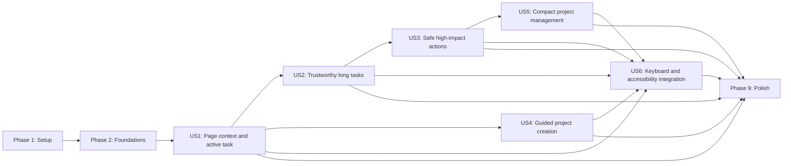

---

description: "Dependency-ordered implementation tasks for frontend interaction and UX improvements"
---

# Tasks: 前端页面交互与用户体验优化

**Input**: Design documents from `/specs/001-frontend-ux-improvements/`

**Prerequisites**: [plan.md](./plan.md), [spec.md](./spec.md), [research.md](./research.md), [data-model.md](./data-model.md), [contracts/](./contracts/), [quickstart.md](./quickstart.md)

**Tests**: Tests are mandatory under the project constitution. For each behavior task, add or update the listed test first and confirm it fails for the intended reason before implementation.

**Organization**: Tasks are grouped by user story so each story can be implemented and validated as an independent increment. Paths are repository-relative.

## Format: `[ID] [P?] [Story] Description`

- **[P]**: Can run in parallel because it changes different files and has no dependency on unfinished tasks.
- **[Story]**: Maps the task to a user story in [spec.md](./spec.md).
- Every task includes an exact file path and an observable completion condition.

## Phase 1: Setup (Shared Infrastructure)

**Purpose**: Enable the repository's existing frontend test suite as a required Windows CI gate without changing dependencies or architecture.

- [X] T001 Add `pnpm test` after typecheck and before build in the Windows baseline job in `.github/workflows/ci.yml`, then verify the workflow still uses Node 22 and pnpm 11.12.0.

**Checkpoint**: CI now enforces the constitution's existing frontend test requirement.

---

## Phase 2: Foundational (Blocking Prerequisites)

**Purpose**: Create the shared async, error, feedback, modal, roving-focus, and shortcut primitives used by all six stories.

**CRITICAL**: Complete this phase before starting user-story implementation.

### Tests for shared foundations

- [X] T002 [P] Add failing state-transition, complete-empty success, partial success with retryable and non-retryable issues, stale-data retention, total-failure, request-key race, unsafe-retry suppression, and single-flight mutation tests for `AsyncResource<T>` in `apps/desktop/src/hooks/useAsyncResource.test.ts`.
- [X] T003 [P] Add failing structured-object, JSON-string, legacy-string, fallback-action, and canary-redaction tests in `apps/desktop/src/services/errors.test.ts`.
- [X] T004 [P] Add failing topmost focus trap, forward/reverse Tab, busy Escape, inert restoration, opener restoration, and fallback-focus tests in `apps/desktop/src/components/primitives/ModalSurface.test.tsx`.

### Implementation for shared foundations

- [X] T005 [P] Define `AsyncResource`/`AsyncResourceMeta` with complete-versus-partial metadata and safe `AsyncPartialIssue`, `UiError`, `UiErrorAction`, `ActionReceipt`, `OverlayState`, and workspace action preview/execute discriminated unions in `apps/desktop/src/types/async.ts`, `apps/desktop/src/types/errors.ts`, and `apps/desktop/src/types/interactions.ts`, and export them from `apps/desktop/src/types/index.ts`.
- [X] T006 Implement the reducer/hook that distinguishes complete-empty, partial, refresh-stale, and total-failure states, preserves last successful data, rejects stale request keys, exposes accurate retry metadata, emits Retry only for known-safe operations, and enforces action-key single flight in `apps/desktop/src/hooks/useAsyncResource.ts`, making T002 pass.
- [X] T007 Implement dual-format error normalization, stable fallback codes/actions, and shared credential/path redaction in `apps/desktop/src/services/errors.ts`, making T003 pass without exposing raw technical causes.
- [X] T008 Implement the topmost modal stack, focus trap/restore, background inert reference counting, roving focus, and editable/IME shortcut guards in `apps/desktop/src/hooks/useModalFocus.ts`, `apps/desktop/src/hooks/useRovingFocus.ts`, `apps/desktop/src/hooks/useShortcutGuard.ts`, and `apps/desktop/src/components/primitives/ModalSurface.tsx`, making T004 pass.
- [X] T009 Build reusable visible feedback components with correct alert/status semantics in `apps/desktop/src/components/feedback/ErrorNotice.tsx`, `apps/desktop/src/components/feedback/AsyncStatus.tsx`, `apps/desktop/src/components/feedback/ActionReceipt.tsx`, and `apps/desktop/src/components/feedback/StatusAnnouncer.tsx`.
- [X] T010 Export the shared hooks, primitives, and feedback components without adding third-party dependencies in `apps/desktop/src/hooks/index.ts`, `apps/desktop/src/components/primitives/index.ts`, and `apps/desktop/src/components/feedback/index.ts`.

**Checkpoint**: Shared state and interaction infrastructure is test-backed and ready for all stories.

---

## Phase 3: User Story 1 — 清楚理解当前任务与下一步 (Priority: P1) MVP

**Goal**: Give project center, creation wizard, and workspace distinct page contexts while keeping the single active Pipeline discoverable and preventing a second project from starting, cancelling, or queuing work.

**Independent Test**: Render home, new-project, and project-detail states; verify only workspace shows project run controls, an active project remains visible across navigation, project B cannot start while A runs, and one action returns to A.

### Tests for User Story 1

- [X] T011 [P] [US1] Add failing home/wizard/workspace context, cross-page active summary, project-isolation, one-step-return, and start-conflict tests in `apps/desktop/src/App.test.tsx`.
- [X] T012 [P] [US1] Extend `apps/desktop/src/components/shell/TitleRunBar.test.tsx` with failing tests for no-project control suppression, truthful unknown progress, conflict description, focus preservation, and no fabricated ETA.
- [X] T013 [P] [US1] Add failing Rust command-contract tests for `get_active_pipeline_summary` active/null/safe-error payloads plus tests proving active-project conflict is checked before engine/GPU preflight or target writes, `resume_pipeline` does not persist B as Recovering, and A is neither cancelled nor queued in `apps/desktop/src-tauri/src/commands/pipeline.rs`.

### Implementation for User Story 1

- [X] T014 [P] [US1] Implement page-specific title, purpose, primary action, and back action rendering in `apps/desktop/src/components/shell/WorkspaceHeader.tsx`.
- [X] T015 [P] [US1] Implement the single active project's safe name, phase/stage, progress, freshness, and one-step navigation control in `apps/desktop/src/components/shell/BackgroundTaskSummary.tsx`.
- [X] T016 [P] [US1] Implement a focus-preserving, `aria-describedby`-linked blocker with a “返回活动项目” action in `apps/desktop/src/components/shell/PipelineConflictNotice.tsx`.
- [X] T017 [US1] Add `get_active_pipeline_summary`, move the authoritative active gate before preflight/writes, and guard resume before writing Recovering in `apps/desktop/src-tauri/src/commands/pipeline.rs`; register the new command in `apps/desktop/src-tauri/src/lib.rs` and make T013 pass.
- [X] T018 [P] [US1] Add the active-summary IPC method and conflict error mapping while preserving existing command signatures in `apps/desktop/src/services/desktop.ts` and `apps/desktop/src/types/pipeline.ts`.
- [X] T019 [US1] Extend per-project Pipeline caches, sequence merge rules, active selector, freshness, and conflict state in `apps/desktop/src/context/appContextValue.ts` and its tests in `apps/desktop/src/context/appContextValue.test.ts`.
- [X] T020 [US1] Lift Pipeline event listening and active-summary refresh to the application lifecycle, render `WorkspaceHeader` and `BackgroundTaskSummary`, and navigate back to the correct project in `apps/desktop/src/App.tsx`, making T011 pass.
- [X] T021 [US1] Restrict run controls to project context, replace linear ETA with stage/actual units/“正在估算”, and integrate the conflict notice in `apps/desktop/src/components/shell/TitleRunBar.tsx`, making T012 pass.
- [X] T022 [US1] Apply the same active-project guard and race-rejection refresh to every start/resume/rerun entry in `apps/desktop/src/App.tsx`, `apps/desktop/src/pages/NewProjectPage.tsx`, and `apps/desktop/src/pages/ProjectDetailPage.tsx`; ensure “创建并开始 B” keeps the created project but skips start and reports that B was not queued.

**Checkpoint**: User Story 1 is independently usable as the MVP: context is clear, the active task survives navigation, and a second execution cannot start.

---

## Phase 4: User Story 2 — 可信地等待、诊断和恢复长任务 (Priority: P1)

**Goal**: Show trustworthy progress and freshness, searchable activity history, actionable errors, and coordinated recovery feedback without clearing last valid data.

**Independent Test**: Exercise running, unknown progress, refresh failure, stage failure, retry success, and 1,000-event history states; verify stale data is retained, errors provide direct actions, and related facts converge after recovery.

### Tests for User Story 2

- [X] T023 [P] [US2] Replace/extend `apps/desktop/src/pages/ProjectDetailPage.test.ts` with failing tests for artifact/checkpoint complete-empty, partial success with both retryable and non-retryable issues, last-good retention, total failure, stale timestamps, safe Retry visibility, unsafe Retry suppression, stage-linked context, and coordinated refresh after recovery.
- [X] T024 [P] [US2] Add failing cursor pagination, complete-empty and partial-success states, stage/severity/search filtering, deterministic 1,000-record merge, stale retention, selected-stage context, target visibility/focus, and live-region throttling tests in `apps/desktop/src/components/workspace/ActivityWorkbench.test.tsx`; keep formal p95 timing out of jsdom and in T078/T082.
- [X] T025 [P] [US2] Add failing title/message/impact/code/suggestion/action, safe technical-detail, Settings total-load-failure, persistent receipt, shared invoke normalization, raw-invoke boundary audit, and action-key single-flight tests in `apps/desktop/src/components/feedback/ErrorNotice.test.tsx`, `apps/desktop/src/components/settings/SettingsDrawer.test.tsx`, `apps/desktop/src/hooks/useTauriCommand.test.ts`, and `apps/desktop/src/services/desktop.test.ts`.

### Implementation for User Story 2

- [X] T026 [P] [US2] Implement cursor-based load-more, stage/severity/search filters, sequence de-duplication, selected-stage linkage, and non-spamming freshness messages in `apps/desktop/src/components/workspace/ActivityWorkbench.tsx`, making T024 pass.
- [X] T027 [US2] Replace `Promise.allSettled` error suppression with independent `AsyncResource` state for artifacts, checkpoints, activity, and previews in `apps/desktop/src/pages/ProjectDetailPage.tsx`, rendering complete-empty, partial-with-safe-retry-or-non-replay recovery, refresh-stale, and total-failure states without discarding available data, making T023 pass.
- [X] T028 [P] [US2] Render actionable normalized errors, safe expandable details, Retry only when `retryable=true`, settings/activity/diagnostic alternatives for unsafe retries, and persistent receipts in `apps/desktop/src/components/feedback/ErrorNotice.tsx`, `apps/desktop/src/components/feedback/ActionReceipt.tsx`, and `apps/desktop/src/components/settings/SettingsDrawer.tsx`, making the feedback/settings portions of T025 pass.
- [X] T029 [US2] Add command-specific fallback actions, route `desktopApi` and the existing hook through one normalized invoke boundary, and add an audit test that rejects page/component/hook-level raw Tauri `invoke` calls in `apps/desktop/src/services/desktop.ts`, `apps/desktop/src/services/desktop.test.ts`, `apps/desktop/src/services/errors.ts`, `apps/desktop/src/hooks/useTauriCommand.ts`, `apps/desktop/src/hooks/useTauriCommand.test.ts`, and `apps/desktop/src/localization.ts`, making the invoke/error portions of T025 pass.
- [X] T030 [US2] Coordinate event-triggered invalidation and authoritative refresh of Pipeline, activity, artifacts, and checkpoints while retaining polling fallback in `apps/desktop/src/App.tsx` and `apps/desktop/src/pages/ProjectDetailPage.tsx`.
- [X] T031 [US2] Display phase/stage, actual work units, activity/freshness timestamps, `aria-valuetext`, and unknown progress without zero/success substitution in `apps/desktop/src/components/shell/TitleRunBar.tsx` and `apps/desktop/src/components/PipelineProgress.tsx`.
- [X] T032 [US2] Integrate the de-duplicated status announcer for stage changes, stale/recovered transitions, and operation results while excluding resource polling and individual log rows in `apps/desktop/src/App.tsx` and `apps/desktop/src/components/feedback/StatusAnnouncer.tsx`.

**Checkpoint**: User Story 2 independently demonstrates trustworthy long-task monitoring, diagnosis, and recovery.

---

## Phase 5: User Story 3 — 安全执行中断和不可逆操作 (Priority: P1)

**Goal**: Preview exact impact for pause, cancel, rerun, checkpoint restore/delete, and project delete; reject stale, expired, or replayed confirmations with zero writes; require explicit reconfirmation and show a persistent result.

**Independent Test**: Preview each high-impact action, mutate its influencing state before confirm, verify old tokens cause no filesystem/state change and refresh in place, then explicitly confirm the new preview once.

### Tests for User Story 3

- [X] T033 [P] [US3] Add failing 10-minute expiry, action/target mismatch, fingerprint-stale, single-consume, replay, and bounded cleanup tests for the in-memory preview registry in `apps/desktop/src-tauri/src/state.rs`.
- [X] T034 [P] [US3] Add separate failing pause/cancel/rerun impact-derivation tests and `preview_workspace_action -> execute_workspace_action` command-contract tests covering valid/malformed requests, completed dispatch, allowed=false, stale/expired/replay unions, safe serialization, zero writes on rejection, and unchanged legacy command signature/success/failure validation in `apps/desktop/src-tauri/src/commands/pipeline.rs`.
- [X] T035 [P] [US3] Add separate failing restore/delete checkpoint impact-derivation tests and command-contract tests covering preserved/invalidated/regenerated output, unique/current blockers, restore limitation, fingerprint change, completed dispatch, stale/expired/replay, zero writes on rejection, and unchanged legacy command signature/success/failure validation in `apps/desktop/src-tauri/src/commands/workspace.rs`.
- [X] T036 [P] [US3] Add separate failing permanent-delete impact-derivation tests and command-contract tests covering target/range/size, active blocker, identity validation, completed dispatch, stale/expired/replay, safe serialization, zero writes on rejection, and unchanged legacy command signature/success/failure validation in `apps/desktop/src-tauri/src/commands/project.rs`.
- [X] T037 [P] [US3] Add failing safe-default focus, single submit, stale in-place refresh, alert text, focus-to-updated-heading, reconfirm, refresh-failure, and persistent receipt tests in `apps/desktop/src/components/workspace/WorkspaceActionDialog.test.tsx`; add a failing service-boundary assertion that all new high-impact UI APIs expose preview/guarded execute without directly invoking legacy mutations in `apps/desktop/src/services/desktop.test.ts`.

### Implementation for User Story 3

- [X] T038 [P] [US3] Add closed action request/preview/token/stale/completed receipt types and `previewWorkspaceAction`/`executeWorkspaceAction` methods in `apps/desktop/src/types/interactions.ts` and `apps/desktop/src/services/desktop.ts`.
- [X] T039 [US3] Implement the opaque single-use token registry, 10-minute expiry, impact fingerprint storage, atomic consume, replay rejection, and cleanup in `apps/desktop/src-tauri/src/state.rs`, making T033 pass.
- [X] T040 [P] [US3] Derive pause/cancel/rerun targets, preserved/invalidated/regenerated content, blockers, and influence-only fingerprints from authoritative Pipeline state in `apps/desktop/src-tauri/src/commands/pipeline.rs`, making the impact-derivation group of T034 pass.
- [X] T041 [P] [US3] Derive checkpoint restore/delete impact and fingerprints from authoritative checkpoint/current/validity/size metadata in `apps/desktop/src-tauri/src/commands/workspace.rs`, making the impact-derivation group of T035 pass.
- [X] T042 [P] [US3] Derive project-delete target/range/size/active/identity impact without exposing absolute paths in `apps/desktop/src-tauri/src/commands/project.rs`, making the impact-derivation group of T036 pass.
- [X] T043 [US3] Implement and register `preview_workspace_action` plus guarded `execute_workspace_action`, returning `completed` or zero-write `stale` unions, making the command-contract groups of T034–T036 pass, and preserving legacy mutation signatures plus their original server identity/legality validation in `apps/desktop/src-tauri/src/commands/workspace.rs` and `apps/desktop/src-tauri/src/lib.rs`.
- [X] T044 [US3] Implement the shared impact dialog with safe Cancel focus, busy single flight, expired/stale in-place refresh, cleared arming state, explicit reconfirmation, refresh Retry, and receipts in `apps/desktop/src/components/workspace/WorkspaceActionDialog.tsx`, making T037 pass.
- [X] T045 [US3] Route pause and cancel through preview/guarded execute and show preserved results in `apps/desktop/src/components/shell/TitleRunBar.tsx` and `apps/desktop/src/App.tsx`.
- [X] T046 [US3] Route rerun plus checkpoint restore/delete through preview/guarded execute and authoritative post-action refresh in `apps/desktop/src/pages/ProjectDetailPage.tsx` and `apps/desktop/src/components/workspace/CheckpointDrawer.tsx`.
- [X] T047 [US3] Route permanent project deletion through preview/guarded execute, retain the safe-cancel behavior, and refresh recent projects only after a completed receipt in `apps/desktop/src/components/shell/DeleteProjectDialog.tsx` and `apps/desktop/src/App.tsx`.

**Checkpoint**: User Story 3 independently proves every high-impact action has accurate impact, safe cancellation, stale-confirmation protection, and verifiable results.

---

## Phase 6: User Story 4 — 顺畅完成首次项目创建 (Priority: P2)

**Goal**: Guide first-time users through source selection, checks, plan selection, creation/copy progress, safe cancellation, and unsaved-exit protection without requiring engine terminology.

**Independent Test**: Complete the wizard with valid media, then exercise invalid media, disk-space/write blockers, changed directory/preset, unsaved exit, copy cancellation, repeated submission, and active-project conflict.

### Tests for User Story 4

- [X] T048 [P] [US4] Extend `apps/desktop/src/pages/NewProjectPage.test.tsx` with failing tests for step purpose/conditions, notice-warning-blocker separation, input-change invalidation, dirty-exit confirmation, copy progress/cancel, repeated submit, and editing/IME shortcut safety.
- [X] T049 [P] [US4] Add failing tests that “创建并开始 B” completes creation but skips start, does not queue, and exposes project A with one-step return in `apps/desktop/src/App.test.tsx`.

### Implementation for User Story 4

- [X] T050 [US4] Present user-language source guidance, step completion, unmet continue conditions, notice/warning/blocker groups, repair actions, and recheck controls in `apps/desktop/src/pages/NewProjectPage.tsx`.
- [X] T051 [US4] Invalidate only affected preflight results when source, destination, or preset changes; add dirty/active-copy exit confirmation and shortcut guards in `apps/desktop/src/pages/NewProjectPage.tsx`, making the relevant T048 cases pass.
- [X] T052 [US4] Add actual copy/current-action progress, single-flight create, safe cancellation outcome, and actionable normalized create errors in `apps/desktop/src/pages/NewProjectPage.tsx` and `apps/desktop/src/components/feedback/AsyncStatus.tsx`.
- [X] T053 [US4] Handle active-project conflict after successful creation by navigating to the created project, showing “未启动且未排队” with A's one-step return, and leaving both project states valid in `apps/desktop/src/pages/NewProjectPage.tsx` and `apps/desktop/src/App.tsx`, making T049 pass.

**Checkpoint**: User Story 4 independently supports a safe and understandable first-project journey.

---

## Phase 7: User Story 5 — 在最小窗口中查找和管理项目 (Priority: P2)

**Goal**: Keep the complete project list, name/path search, per-project status/menu, non-blocking path health, safe relink, and focus restoration available at 1024×768 and 125%/150% scaling.

**Independent Test**: Load 20–50 projects including available, missing, invalid, and temporarily uncheckable paths; verify the list appears before probes finish, statuses update in place with at most four probes, relink mismatch preserves the record, and the compact drawer is one action away.

### Tests for User Story 5

- [X] T054 [P] [US5] Add failing Rust tests for fast index reads without path access, available responses with matching refreshed `ProjectInfo`, NotFound/unreadable/check-failed classification, no-write checks, recoverable index install/read-back/rollback, startup recovery, same-ID relink, mismatch/conflict zero writes, no automatic open, and concurrent create/record/open/remove/delete/relink serialization with no lost update, lock release after failure, and availability probes never holding the writer lock in `apps/desktop/src-tauri/src/commands/project.rs`.
- [X] T055 [P] [US5] Extend `apps/desktop/src/context/appContextValue.test.ts` with failing unknown/checking/terminal, path+generation stale-response rejection, refreshed-project ID/path/`updated_at` merge, active-Pipeline precedence, remove/relink invalidation, single-item Retry, and maximum-four-concurrency tests.
- [X] T056 [P] [US5] Add failing 20–50 item name/path search, ready/running/failed/completed lifecycle rendering, stable order/focus/menu during lifecycle and availability updates, distinct available/missing/unreadable/check-failed texts/icons, unreadable diagnosis/relink without direct Retry, check-failed single-item Retry, mismatch actions, and no automatic independent-open tests in `apps/desktop/src/components/shell/ProjectNavigator.test.tsx`.
- [X] T057 [P] [US5] Add failing one-action open, full list/menu, Escape/backdrop, focus trap, and opener restoration tests at the compact breakpoint in `apps/desktop/src/components/shell/ProjectDrawer.test.tsx`.

### Implementation for User Story 5

- [X] T058 [US5] Implement `list_recent_project_index` and async single-record `check_recent_project_availability` using `spawn_blocking`, explicit NotFound versus I/O classification, mandatory matching `refreshed_project` for available results, safe reason codes, and no project/index writes in `apps/desktop/src-tauri/src/commands/project.rs`, making the probe portions of T054 pass.
- [X] T059 [US5] Add an application-scoped recent-index writer mutex in `apps/desktop/src-tauri/src/state.rs`; implement validated same-ID `relink_recent_project` and route every create/record/open/remove/delete/relink read-modify-write plus AppState synchronization through the same lock using temp parse validation, recovery backup, install, read-back validation, rollback, startup recovery, and failure-safe unlock in `apps/desktop/src-tauri/src/commands/project.rs`, making the persistence and concurrency portions of T054 pass.
- [X] T060 [US5] Register `list_recent_project_index`, `check_recent_project_availability`, and `relink_recent_project` without changing legacy command registration in `apps/desktop/src-tauri/src/lib.rs`.
- [X] T061 [P] [US5] Define session-only availability/relink types including `refreshed_project` and add fast-index, single-probe, and relink APIs without changing `ProjectInfo` in `apps/desktop/src/types/project.ts` and `apps/desktop/src/services/desktop.ts`.
- [X] T062 [US5] Store availability by project ID/path/generation, run a maximum-four promise pool after index load, discard late results, merge matching non-regressing `refreshed_project` lifecycle fields while preserving active-Pipeline precedence and list order, and expose single-item Retry in `apps/desktop/src/context/appContextValue.ts`, `apps/desktop/src/hooks/useProjectAvailability.ts`, and `apps/desktop/src/App.tsx`, making T055 pass.
- [X] T063 [US5] Implement shared name/path search, stable project rows, ready/running/failed/completed lifecycle labels, distinct available/missing/unreadable/check-failed semantics, diagnosis/relink for unreadable, Retry plus focus fallback only for check-failed, project menus, relink mismatch error, and explicit independent-open action in `apps/desktop/src/components/shell/ProjectNavigator.tsx`, making T056 pass.
- [X] T064 [US5] Reuse `ProjectNavigator` in the wide sidebar and a modal compact drawer reachable from the 64px rail in `apps/desktop/src/components/shell/ProjectSidebar.tsx`, `apps/desktop/src/components/shell/ProjectDrawer.tsx`, and `apps/desktop/src/components/shell/index.ts`, making T057 pass.
- [X] T065 [US5] Wire relink directory selection, mismatch preservation, independent open, remove, reveal, delete, retry, and focus-safe navigation through existing service boundaries in `apps/desktop/src/App.tsx` and `apps/desktop/src/pages/HomePage.tsx`.
- [X] T066 [US5] Implement 1024×768/125%/150% reflow, drawer scrolling/sticky actions, long-name/path wrapping, and no horizontal content loss in `apps/desktop/src/App.css`.

**Checkpoint**: User Story 5 independently supports complete project discovery and management in the minimum supported window.

---

## Phase 8: User Story 6 — 使用键盘和辅助功能完成核心流程 (Priority: P2)

**Goal**: Make core flows keyboard-complete with consistent focus, modal, menu, tab, stage, shortcut, status, contrast, and reduced-motion behavior.

**Independent Test**: Use only the keyboard to create/open/switch a project, inspect stage activity, retry an error, close drawers, and cancel a dangerous action; verify focus under high contrast, scaling, IME, and reduced motion.

### Tests for User Story 6

- [X] T067 [P] [US6] Extend/add modal integration tests for initial focus, forward/reverse trap, busy behavior, parent rerender, topmost Escape, inert cleanup, and opener restoration in `apps/desktop/src/components/shell/DeleteProjectDialog.test.tsx`, `apps/desktop/src/components/settings/SettingsDrawer.test.tsx`, and `apps/desktop/src/components/workspace/CheckpointDrawer.test.tsx`.
- [X] T068 [P] [US6] Extend menu tests for trigger ARIA, open focus, ArrowUp/Down, Home/End, disabled skipping, Escape/Tab close, and trigger restoration in `apps/desktop/src/components/shell/TitleRunBar.test.tsx` and `apps/desktop/src/components/shell/ProjectNavigator.test.tsx`.
- [X] T069 [P] [US6] Add failing roving tab/stage ID relationships, arrow/Home/End behavior, automatic tab activation, phase disclosure, current-stage semantics, and narrow inspector focus tests in `apps/desktop/src/components/workspace/ActivityWorkbench.test.tsx` and `apps/desktop/src/pages/ProjectDetailPage.test.ts`.
- [X] T070 [P] [US6] Add failing global/page shortcut tests for input, textarea, select, contenteditable, ARIA editor roles, `defaultPrevented`, IME/keyCode 229, and topmost overlay handling in `apps/desktop/src/App.test.tsx` and `apps/desktop/src/pages/NewProjectPage.test.tsx`.

### Implementation for User Story 6

- [X] T071 [US6] Apply `ModalSurface` and stable opener capture to delete, settings, checkpoint, quality, and compact-inspector overlays in `apps/desktop/src/components/shell/DeleteProjectDialog.tsx`, `apps/desktop/src/components/settings/SettingsDrawer.tsx`, `apps/desktop/src/components/workspace/CheckpointDrawer.tsx`, and `apps/desktop/src/pages/ProjectDetailPage.tsx`, making T067 pass.
- [X] T072 [US6] Apply the shared menu roving contract and complete trigger/menuitem ARIA to the run and project menus in `apps/desktop/src/components/shell/TitleRunBar.tsx` and `apps/desktop/src/components/shell/ProjectNavigator.tsx`, making T068 pass.
- [X] T073 [US6] Implement single-tab-stop tabs, panel relationships, phase disclosure ARIA, semantic stage buttons, and stage roving focus in `apps/desktop/src/components/settings/SettingsDrawer.tsx`, `apps/desktop/src/components/workspace/ActivityWorkbench.tsx`, and `apps/desktop/src/pages/ProjectDetailPage.tsx`, making T069 pass.
- [X] T074 [US6] Route all application and wizard shortcuts through the editable/IME/default-prevented/top-overlay guard, with local Escape consumption before global navigation, in `apps/desktop/src/App.tsx` and `apps/desktop/src/pages/NewProjectPage.tsx`, making T070 pass.
- [X] T075 [US6] Add complete accessible names/descriptions, `aria-busy`, truthful progress values, current selection, non-color status text/icons, and de-duplicated announcements across `apps/desktop/src/components/shell/WorkspaceHeader.tsx`, `apps/desktop/src/components/workspace/ActivityWorkbench.tsx`, and `apps/desktop/src/components/feedback/StatusAnnouncer.tsx`.
- [X] T076 [US6] Extend `:focus-visible` to all interactive elements, add forced-colors treatment, stop nonessential motion/spinners under reduced-motion, and keep textual loading status in `apps/desktop/src/App.css`.

**Checkpoint**: User Story 6 independently passes the keyboard-only and assistive-state acceptance flow.

---

## Phase 9: Polish & Cross-Cutting Quality Gates

**Purpose**: Prove compatibility, privacy, performance, Windows behavior, and complete regression safety across all stories.

- [X] T077 [P] Add cross-surface canary tests proving credentials, `PrivateUser`, absolute project paths, raw engine output, and unrelated logs do not appear in default UI, copied details, receipts, or diagnostics in `apps/desktop/src/services/errors.test.ts` and `apps/desktop/src/components/workspace/ActivityWorkbench.test.tsx`.
- [X] T078 [P] Add a sanitized validation record template with all six constitution-principle sign-offs; an async-operation inventory section; legacy-project open/start/pause/cancel/resume/preview/export results; schema/checksum comparisons; window screenshots; anonymous minimum-10-participant scripts/results/median ratings for SC-001/002/004/005/012; and release-build monotonic-clock sample tables, environment, p95 calculations, and thresholds for SC-003/009/010 in `specs/001-frontend-ux-improvements/validation-results.md`.
- [X] T079 Audit every feature-touched async query and mutation against FR-011/FR-016/FR-029, add any missing owner tests for loading/busy, complete-empty or partial success where applicable, normalized failure, accurate retryability, safe retry only where applicable, fresh target/impact validation before retrying side-effecting mutations, success receipt, and primary-mutation action-key single flight in `apps/desktop/src/App.test.tsx`, `apps/desktop/src/pages/NewProjectPage.test.tsx`, `apps/desktop/src/pages/ProjectDetailPage.test.ts`, `apps/desktop/src/components/shell/ProjectNavigator.test.tsx`, `apps/desktop/src/components/workspace/WorkspaceActionDialog.test.tsx`, `apps/desktop/src/hooks/useTauriCommand.test.ts`, and `apps/desktop/src/services/desktop.test.ts`, then record the operation-to-test mapping in `specs/001-frontend-ux-improvements/validation-results.md`.
- [X] T080 Run `pnpm lint`, `pnpm typecheck`, `pnpm test`, and `pnpm build` from the scripts defined in `package.json`; fix all failures in their owning `apps/desktop/src/**` files without suppressing warnings.
- [X] T081 Run `cargo fmt --all -- --check`, `cargo clippy --workspace --all-targets --all-features -- -D warnings`, and `cargo test --workspace --all-targets` from `./Cargo.toml`; fix all failures without weakening lint settings.
- [ ] T082 Run `pnpm --dir apps/desktop tauri build --debug --no-bundle` on Windows and require exit code 0 before executing the real Tauri scenarios including app restart, Windows sleep/resume, controlled external-process termination, the 1440×1024 plus 1024×768 at 100%/125%/150% keyboard-only/forced-colors/reduced-motion matrix, the minimum-10-participant usability protocol, and SC-003/009/010 timing samples from `specs/001-frontend-ux-improvements/quickstart.md`; record the build result and only sanitized scenario evidence in `specs/001-frontend-ux-improvements/validation-results.md`.
- [X] T083 Document the user-visible UX changes, new additive Tauri commands, preserved legacy command behavior, no project/schema migration, and Windows Tauri build gate in the Unreleased section of `CHANGELOG.md` and in the command-boundary/validation sections of `docs/architecture.md` and `docs/development.md`.
- [ ] T084 Verify `schemas/project.schema.json`, representative legacy projects, legacy mutation signature/validation behavior, user-media checksums, `.gitignore`, final `git status`, the Tauri build evidence, and release documentation show no project/schema migration, user-media mutation, secrets, logs, diagnostics, environment files, engine binaries, or private paths; have reviewers explicitly record PASS/evidence or a constitution-compliant exception for each of the six principles in `specs/001-frontend-ux-improvements/validation-results.md`.

**Checkpoint**: All automated and real-Windows gates pass with sanitized evidence and no compatibility, migration, or privacy regression.

---

## Dependencies & Execution Order

### Phase Dependencies

1. **Setup (Phase 1)** has no dependencies.
2. **Foundational (Phase 2)** depends on Setup and blocks every user story.
3. **US1, US2, US3, and US5** may start isolated failing tests and non-overlapping Rust/component work after Foundational, but shared-surface integration must land in the order US1 → US2 → US3 → US5 because they overlap `App.tsx`, `ProjectDetailPage.tsx`, `TitleRunBar.tsx`, and `desktop.ts`.
4. **US4** depends on US1's active-Pipeline selector/conflict contract for its “创建并开始” edge case, but its wizard tests and guidance work can begin after Foundational.
5. **US6** primitive tests can begin after Foundational; its integration tasks should follow the corresponding surfaces from US1–US5 to avoid duplicate rewrites.
6. **Polish (Phase 9)** depends on every story selected for release; T077 and T078 may start together, T079 follows T078, T080/T081 run after implementation plus T079's missing-test audit, T082 follows both toolchain gates, T083 follows validated behavior and build evidence, and T084 is final.

### User Story Dependency Graph



### Within Each User Story

- Write the listed tests first and confirm they fail for the intended missing behavior.
- Add/extend types and service contracts before state reducers and components consume them.
- Keep Rust as the authoritative boundary for Pipeline conflicts, path identity, action impact, and persistence safety.
- Implement core behavior before page/app integration.
- Treat story independence as an acceptance boundary, not permission to edit shared integration files concurrently; rebase on the prior story before touching `App.tsx`, `ProjectDetailPage.tsx`, `TitleRunBar.tsx`, or `desktop.ts`.
- Run the story's focused tests and independent scenario before marking its checkpoint complete.

### Parallel Opportunities by Story

- **US1**: T011–T013 in parallel; after tests, T014–T016 and T018 in parallel while T017 implements Rust authority.
- **US2**: T023–T025 in parallel; after tests, T026 and T028 can proceed in parallel, T029 closes the shared invoke/error boundary, then integration T030–T032 can finish.
- **US3**: T033–T037 in parallel; after token types/state exist, T040–T042 can derive impact in parallel before T043.
- **US4**: T048 and T049 in parallel; guidance, invalidation, and copy states then land sequentially in the shared page file.
- **US5**: T054–T057 in parallel; after T054 defines the concurrency contract, T061 may implement frontend contracts while T058 implements probes, then T059 owns `state.rs`/`project.rs` writer serialization before T060 registration; T062 starts after T058 and T061, while T063 starts after T061 against the implemented frontend contract.
- **US6**: T067–T070 in parallel; modal, menu, tab/stage, and shortcut implementations can proceed by surface once upstream story components stabilize.

---

## Parallel Execution Examples

### User Story 1

```text
Parallel test batch: T011 App context, T012 run bar, T013 Rust active gate
Parallel implementation batch: T014 WorkspaceHeader, T015 BackgroundTaskSummary, T016 PipelineConflictNotice, T018 frontend IPC types
```

### User Story 2

```text
Parallel test batch: T023 ProjectDetail freshness, T024 ActivityWorkbench, T025 error/settings feedback
Parallel implementation batch: T026 activity pagination, T028 feedback/settings states
```

### User Story 3

```text
Parallel test batch: T033 token registry, T034 Pipeline impact, T035 checkpoint impact, T036 delete impact, T037 dialog
Parallel domain batch: T040 Pipeline impact, T041 checkpoint impact, T042 project-delete impact
```

### User Story 4

```text
Parallel test batch: T048 wizard behavior, T049 create-and-start conflict
Then sequence T050 → T051 → T052 → T053 because all implementation tasks converge on NewProjectPage.tsx
```

### User Story 5

```text
Parallel test batch: T054 Rust project contracts, T055 reducer/pool, T056 navigator, T057 drawer
Parallel contract batch: T058 Rust probes and T061 frontend IPC/types
After T061: T063 navigator implementation; after T058 and T061: T062 availability pool and refreshed-project merge
```

### User Story 6

```text
Parallel test batch: T067 modal surfaces, T068 menus, T069 tabs/stages, T070 shortcuts
After upstream surfaces stabilize: T071 modal integration, T072 menu integration, T073 tabs/stages, T074 shortcuts
```

---

## Implementation Strategy

### MVP First: User Story 1

1. Complete T001–T010.
2. Complete T011–T022.
3. Stop and run the US1 focused tests plus Quickstart Scenario B.
4. Demo the three page contexts, cross-page active summary, truthful progress, and blocked second-project start.

### Incremental Delivery

1. **Foundation + US1**: Clear context and globally discoverable single active task.
2. **US2**: Trustworthy freshness, activity, errors, and recovery.
3. **US3**: Safe high-impact actions with stale-preview protection.
4. **US4**: Guided first-project creation.
5. **US5**: Non-blocking path health and complete compact project management.
6. **US6**: Keyboard, focus, assistive-state, contrast, and motion integration.
7. **Polish**: Full automation, real Windows matrix, compatibility, migration, and privacy evidence.

### Constitution Guardrails for Every Task

- Do not introduce a router, state/query framework, UI library, database, project Schema change, telemetry, cloud upload, or new Tauri capability.
- Keep existing Tauri commands/events and `ProjectInfo`/recent-index/project formats compatible; new contracts are independent commands.
- Do not use `unwrap`, `expect`, panic, ignored `Result`, or generic success fallbacks on fallible production Rust paths.
- Preserve old index/project/media data until replacement is durable and validated; every rejected relink or stale action must be zero-write.
- Keep errors structured, actionable, localized, and redacted; never commit secrets, user projects, media, logs, diagnostics, binaries, or private paths.

## Notes

- `[P]` means the task is safe to execute concurrently with the other listed task(s), not that its tests may be skipped.
- Story labels provide traceability to [spec.md](./spec.md); cross-cutting setup/foundation/polish tasks intentionally have no story label.
- Commit after each task or coherent task group; do not combine unrelated architecture or dependency changes.
- Stop at every checkpoint and verify the independent test before proceeding to the next priority.
